## Java基础


#### 重写override

子类通过重写父类的方法，用自身行为替代父类的行为，方法的重写是实现多态的必要条件。

重写的条件：

+ “= =”：方法名、形参列表相同
+ "$\leq$"：返回值类型和声明异常类型，子类小于等于父类
+ “$\geq$” ：访问权限，子类要大于等于父类


## 封装

封装是把对象的属性和操作结合为一个独立的整体，并尽可能隐藏对象的内部实现细节。封装的要求是“高内聚，低耦合”，高内聚就是类的内部数据操作细节自己完成，不允许外部干涉；低耦合就是仅暴露少量的方法给外部使用，方便外部调用。

封装的优点：

+ 提高代码的安全性
+ 提高代码的复用性
+ 高内聚：封装细节，便于修改内部代码，提高可维护性
+ 低耦合：简化外部调用，便于调用者使用、拓展和协作

#### 封装的实现——访问控制符

Java 是使用访问控制符来控制哪些细节需要封装，哪些细节需要暴露的。 Java 有 4 种“访问控制符”分别为 private、default、protected、public，它们说明了面向对 象的封装性。

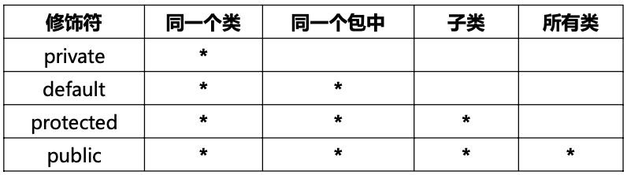

+ private 表示私有，只有自己类能访问

+ default 表示没有修饰符修饰，只有同一个包的类能访问

+ protected 表示可以被同一个包的类以及其他包中的子类访问

+ public 表示可以被该项目的所有包中的所有类访问


#### 封装的规则

1. 属性一般使用 private 访问权限，属性私有后， 提供相应的 get/set 方法来访问相关属性，这些方法通常是public 修饰的，以提供对属性的赋值与读取操作(注意:boolean 变量的 get方法是 is 开头)。
2. 方法：一些只用于本类的辅助性方法可以用 private 修饰，希望其他类调用的方法用 public 修饰。


## 多态

多态是指同一方法的调用，对象不同可能行为不同

+ 多态是方法的多态，不是属性的多态（多态和属性无关）
+ 多态的3个必要条件：继承、方法重写、父类引用指向子类对象
+ 父类引用指向子类对象后，用该父类引用调用重写的方法，多态就出现了

```java
public class text {
    static void animalCry(Animal a){
        a.shout();//多态
    }

    public static void main(String[] args) {
        Animal m = new Mouse();
        animalCry(m);
        Dog d = new Dog();
        animalCry(d);//Animal a = new Dog();
        animalCry(new Cat());//Animal a = new Cat();
    }
}
```

多态最常见的一种用法，即父类引用做方法的形参，实参可是任意子类对象，可以通过不同子类对象实现不同行为。多态的优势是提高了代码的可拓展性，但多态无法调用子类的特有功能。


#### 对象的转型

父类引用指向子类对象，我们称这个过程为**向上转型**，属于自动类型转换。 向上转型后的父类引用变量只能调用它编译类型的方法，不能调用它运行时类型的方法。这时，我们就需要进行类型的强制转换，我们称之为**向下转型**。

```java
Animal d = new Dog();//向上转换，可以自动转换。传的具体是哪一个类就调用哪一个类的方法。大大提高   了程序的可扩展性；d为编译类型，Dog对象才是运行时类型。
animalCry(d);//调用编译类型的方法
Dog d1 = (Dog) d;//强制类型转换
d1.seeDoor();//seeDoor()方法是Dog类特有的方法，必须进行强制类型转换，才能引用。
//Cat c1 = (Cat) d;这里向下强制转换的类型是Cat，但是真是子类是Dog，编写程序时不会报错，运行时报错
if(d instanceof Dog){
    Dog d1 = (Dog)d;
    d1.seeDoor();
}else if(d instanceof Cat){
    Cat c1 = (Cat)d;
    c1.eatMouse();
        }
```

在向下转型过程中，必须将引用变量转成真实的子类类型（运行时类型），否则会出现类型转换异常 ClassCastException。所以在向下转型时，可以使用instanceof来判断。

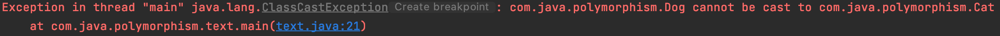


## 特殊类

### 抽象类

**抽象方法** ：使用 abstract 修饰的方法，没有方法体，只有声明。定义的是一种“规范”，就是告诉子类必须要给抽象方法提供具体的实现。

**抽象类**：包含抽象方法的类就是抽象类。通过 abstract 方法定义规范，然后要求子类必须定义具体实现。通过抽象类，我们就可以做到严格限制子类的设计，使子类之间更加通用。

```java
abstract class Animal {
    abstract public void shout();//抽象方法
}
class Dog extends Animal{
    //子类必须实现父类的抽象方法，否则编译错误
    public void shout(){
        System.out.println("汪汪汪");
    }
    public void seeDoor(){
        System.out.println("看门中....");
    }
}

//测试抽象类
public class TestAbstractClass {
    public static void main(String[ ] args) {
        Dog a = new Dog();
        a.shout();
        a.seeDoor();
    }
}
```

**抽象类的使用要点:** 

1. 有抽象方法的类只能定义成抽象类
2. 抽象类不能实例化，即不能用 new 来实例化抽象类；抽象类可以包含属性、方法、构造方法，但是构造方法不能用来 new 实例，只能用来被子类调用
3. 抽象类只能用来被继承
4. 抽象方法必须被子类实现


### 接口

​         接口就是规范，定义的是一组规则。接口就是比“抽象类”还“抽象”的“抽象类”，可以更加规范的对子类进行约束，全面地专业地实现了：**规范和具体实现的分离**。接口是两个模块之间通信的标准，通信的规范。

​         接口和实现类不是父子关系，是实现规则的关系。比如：我定义一个接口 Runnable， Car 实现它就能在地上跑。

#### 接口的定义

```
[访问修饰符] interface 接口名 [extends 父接口 1，父接口 2…] { 
     常量定义； 
     方法定义； 
}
```

**定义接口的详细说明：** 

+ **访问修饰符：**只能是 public 或默认。 

+ **接口名：**和类名采用相同命名机制。 

+ **extends：**接口可以多继承。 

+ **常量：**接口中的属性只能是常量，只能public static final修饰，默认为省略不写。 

+ **方法：**接口中的方法只能是public abstract修饰，默认为省略不写。 

**定义要点**

+ 实现类通过 **implements** 来实现接口中的规范，**一个类可以实现多接口**。 

+ 接口不能创建实例，但是可用于声明引用变量类型。 

+ 一个类实现了接口，必须实现接口中所有的方法，并且这些方法只能是 public 的。 

+ JDK1.8（不含 8）之前，接口中只能包含静态常量、抽象方法，不能有普通属性、构造 方法、普通方法。 

+ **JDK1.8（含 8）后，接口中包含普通的静态方法、默认方法。**

```java
//这个是一个飞行器的接口
public interface Volent {
    /*public static final*/ int MAX_HIGHT = 100;//飞行器飞行的最大高度
    /*public abstract*/ void fly();//飞行方法，调用此方法飞行器可起飞
    void stop();//停止方法，在空中就悬停，在地上就静止
}

/**善良接口*/
interface Honest {
    void helpOther();
}

//实现类实现接口
public class Superman implements Volent,Honest{
    @Override
    public void fly() {
        System.out.println("横着飞");
    }

    @Override
    public void stop() {
        System.out.println("竖着停");
    }

    @Override
    public void helpOther() {
        System.out.println("助人为乐");
    }

    public static void main(String[] args) {
        Superman s = new Superman();
        s.fly();
        s.helpOther();

        Volent s1 = new Superman();
        s1.fly();
        Honest h1 = (Honest)s1;
        h1.helpOther();
    }
}
```


#### 接口定义中默认方法、静态方法（JDK8之后）

##### 默认方法（拓展方法）

​        用关键字**default**修饰接口中的非抽象方法，默认方法有方法体；抽象方法必须要被实现，默认方法不是必须实现，实现类可通过实现接口来调用或重写默认方法。

```java
public class Test { 
	public static void main(String[] args) { 
	A a = new Test_A(); 
	a.moren(); //调用的是重写后的方法
	}
}
interface A { 
	default void moren(){ 
		System.out.println("我是接口 A 中的默认方法！"); 
		} 
}
class Test_A implements A { 
	@Override 
	public void moren() { 
		System.out.println("Test_A.moren"); //重写接口中的默认方法
	} 
}
```

##### 静态方法

​        JAVA8 以后，可以在接口中直接定义静态方法的实现。这个静态方法直接从属于接口，可以通过**接口名调用**。 如果子类中定义了相同名字的静态方法，那就是完全不同的方法了，直接从属于子类，可以通过子类名直接调用。

```java
public class Test { 
  public static void main(String[] args) { 
    A.staticMethod(); 
    Test_A.staticMethod(); 
  } 
}
interface A { 
  public static void staticMethod(){
    System.out.println("A.staticMethod"); 
  } 
}
class Test_A implements A { 
  public static void staticMethod(){
    System.out.println("Test_A.staticMethod"); 
  } 
}
```

默认方法是普通方法，要实现类才能调用；静态方法可由接口名直接调用；**默认方法中可以调用静态方法**。


### 内部类

​		一般情况，我们把类定义成独立的单元。有些情况下，我们把一个类放在另一个类的内部定义，称为内部类(innerclasses)。内部类可以使用 public、default、protected 、private 以及 static 修饰。而外部顶级类（我们以前接触的类）只能使用 public 和 default 修饰。

​		内部类只是一个编译时概念，一旦我们编译成功，就会成为完全不同的两个类。

```java
//外部类
public class Outer1 {
    private int age = 10;
    private void show(){
        System.out.println("你好,Outer");
    }
    //内部类（可以用public或private修饰，看需求）
    public class Inner1{
        private String name = "Tom";
        //可以声明和外部类同名的属性和方法
        private int age = 20;
        public void showInner(){
            System.out.println("你好，Inner");
            System.out.println(age);
            System.out.println(Outer1.this.age);//当外部类和内部类属性重名时，可通过Outer.this.属性名
            show();//内部类可以直接使用外部类的成员
        }
    }

    public static void main(String[] args) {
        Outer1.Inner1 inner1 = new Outer1().new Inner1();
        inner1.showInner();

        Outer1 outer2 = new Outer1();
        Inner1 inner2 = outer2.new Inner1();
        inner2.showInner();
    }
}
```

**内部类的作用：** 

+ 内部类提供了更好的封装。只能让外部类直接访问，不允许同一个包中的其他类直接访问。 

+ 内部类可以直接访问外部类的私有属性，内部类被当成其外部类的成员。 但外部类不能访问内部类的内部属性。 


#### 内部类的分类

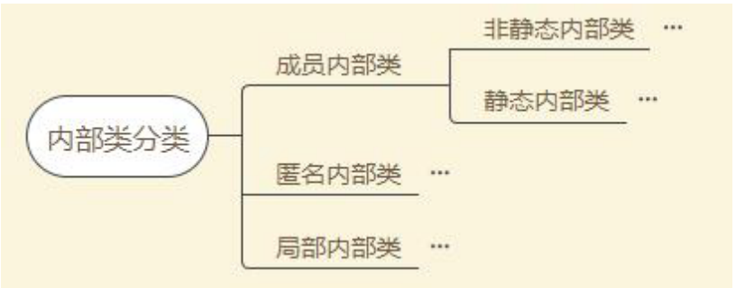

##### 1.非静态内部类 （外部类里使用非静态内部类和平时使用其他类没什么不同）

上面写的内部类就是非静态内部类

1. 非静态内部类对象必须寄存在一个外部类对象里。非静态内部类对象单独属于外部类的某个对象。 
2. 非静态内部类可以直接访问外部类的成员，但是外部类不能直接访问非静态内部类成员。 
3. 非静态内部类不能有静态方法、静态属性和静态初始化块。 
4. **成员变量访问要点：** 
   1. 内部类里方法的局部变量：变量名。
   2. 内部类属性：this.变量名。 
   3. 外部类属性：外部类名.this.变量名。 


##### 2.静态内部类

定义语法

```java
static class ClassName{
//类体 
}
```

**使用要点：** 

1.  静态内部类可以访问外部类的静态成员，不能访问外部类的普通成员。 

2.  静态内部类看做外部类的一个静态成员。 


##### 3.匿名内部类

​		适合那种只需要使用一次的类。比如：键盘监听操作等等。在安卓开发、awt、swing开发中常见。

定义语法

```
new 父类构造器(实参类表) / 实现接口 () { 
//匿名内部类类体！ 
}
```

```java
//测试匿名内部类
public class TestAnonymousInnerClass {
    public void test(A a){
        a.run();
    }

    public static void main(String[] args) {
        TestAnonymousInnerClass tai = new TestAnonymousInnerClass();
        //匿名内部类调用一次定义一次，每次都是新的
        tai.test(new A(){
            @Override
            public void run() {
                System.out.println("匿名内部类测试! 我是新定义的 第一个匿名内部类");
            }
        });

        tai.test(new A(){
            @Override
            public void run() {
                System.out.println("匿名内部类测试! 我是新定义的 第二个匿名内部类");
            }
        });

        //实现类
        tai.test(new AA());


    }
}

//实现类，有名字的类可反复使用
class AA implements A{
    @Override
    public void run() {
        System.out.println("外部定义的类可反复用");
    }
}

interface A{
    void run();
}
```

**使用要点：** 

1.  匿名内部类没有访问修饰符。

2. 匿名内部类没有构造方法，因为它连名字都没有


##### 4.局部内部类 

​		定义在方法内部的，作用域只限于本方法，称为局部内部类。局部内部类的的使用主要是用来解决比较复杂的问题，想创建一个类来辅助我们的解决方案，到那时又不希望这个类是公共可用的，所以就产生了局部内部类。局部内部类和成员内部类一样被编译，只是它的作用域发生了改变，它只能在该方法中被使用，出了该方法就会失效。

```java
//测试局部内部类
public class TestLocalInnerClass { 
  public void show() { 
    //作用域仅限于该方法 
    class Inner3 { 
      public void fun() { 
        System.out.println("helloworld"); 
      } 
    }
    new Inner3().fun(); 
  }
  public static void main(String[ ] args) { 
    new TestLocalInnerClass().show(); 
  } 
}
```


## 字符串 String 类

​		String 类又称作不可变字符序列,String 位于 java.lang 包中，Java 程序默认导入 java.lang 包下的所有类，Java 字符串就是 **Unicode 字符序列**，例如字串“Java”就是 4 个 Unicode 字符’J’、’a’、’v’、’a’组成的。Java 没有内置的字符串类型，而是在标准 Java 类库中提供了一个预定义的类 。

​		String，每个用双引号括起来的字符串都是 String 类的一个实例。

创建String对象

```java
String s1 = new String("abc");
String s2 = "abc";
```

字符串连接,使用“+”，当"+"运算符两侧的操作数中只要有一个是字符串(String)类型，系统会自动将另一个操作数转换为字符串然后再进行连接。 

```java
String s1 = new String("abc");
String s2 = "abc";
String s3 = s1+s2;
System.out.println(s3);//abcabc

int age = 18;
System.out.println("age is "+age);//age is 18
```

字符串相等比较

```java
String s1 = new String("abc");
String s2 = "abc";
String s3 = "abc";
System.out.println(s1==s2);//false//比较的是两者的地址,对象不同
System.out.println(s2==s3);//true
//涉及到字符串比较时，一般用equals方法
System.out.println(s1.equals(s2));//true
```

#### String的方法

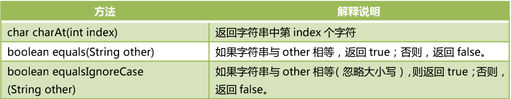

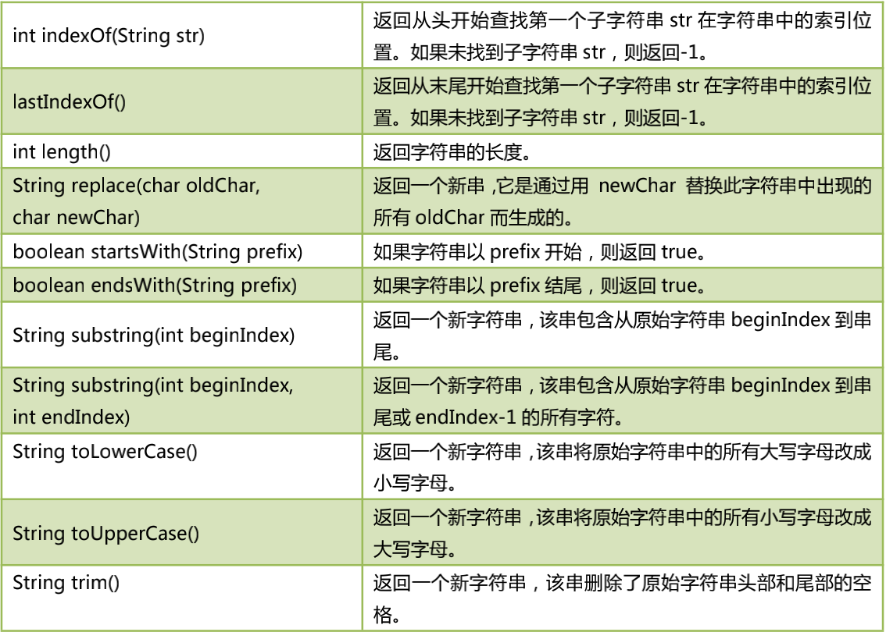

**String是不可变字符序列，所有替换、截取、去空格等都不会影响原字符串，都会重新生成新字符串。**


## 数组

​		数组是相同类型数据的有序集合，每一个数据称作一个元素，每个元素可以通过一个索引（下标）来访问它们。

+ 数组长度是确定的。数组一旦被创建，它的大小就是不可以改变的。
+ 其元素的类型必须是相同类型，不允许出现混合类型。
+ 数组类型可以是任何数据类型，包括基本类型和引用类型。 
+ 数组变量属于引用类型，数组也是对象，数组中的每个元素相当于该对象的成员变量。（Java 中对象是在堆中的，因此数组无论保存原始类型还是其他对象类型，数组对象本身是在堆中存储的）

### 1. 创建数组和初始化

数组的声明（一维数组）

```java
type[] array_name;//方式一（推荐）
type array_name[];//方式二
```

+ 声明的时候并没有实例化任何对象，数组没有被真正创建，只有在实例化数组对象时，JVM 才分配空间，这时才与长度有关。
+ 构造一个数组，必须指定长度。

#### 创建基本类型一维数组

```java
public class Test { 
  public static void main(String args[ ]) { 
    int[ ] s = null; // 声明数组； 
    s = new int[10]; // 给数组分配空间； 
    for (int i = 0; i < 10; i++) { 
      s[i] = 2 * i + 1;//给数组元素赋值； 数组是对象，数组中的元素就是对象的属性 
      System.out.println(s[i]); 
    } 
  } 
}
```

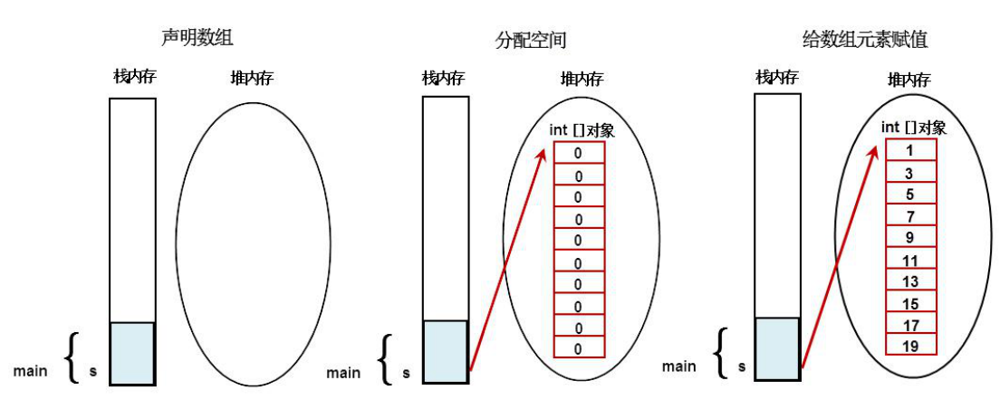

​                                                     基本类型数组内存分配

#### 创建引用类型一维数组

```java
class Man{ 
  private int age; 
  private int id; 
  public Man(int id,int age) { 
    super();
    this.age = age;
    this.id = id; 
  } 
}
public class AppMain { 
  public static void main(String[ ] args) { 
    Man[ ] mans; //声明引用类型数组； 
    mans = new Man[10]; //给引用类型数组分配空间； 
    
    Man m1 = new Man(1,11); 
    Man m2 = new Man(2,22); 
    
    mans[0]=m1;//给引用类型数组元素赋值； 
    mans[1]=m2;//给引用类型数组元素赋值； 
  } 
}
```

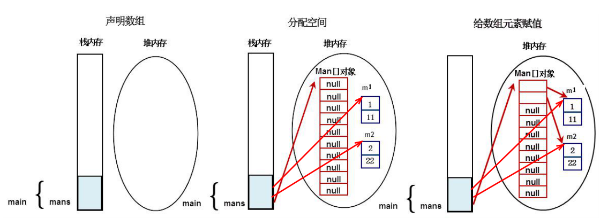

​                                                    引用类型数组内存分配


#### 数组的初始化

数组的初始化方式总共有三种：静态初始化、动态初始化、默认初始化。

##### 1.静态初始化

​		除了用 new 关键字来产生数组以外，还可以直接在定义数组的同时就为数组元素分配空间并赋值。

```java
int[ ] a = { 1, 2, 3 };// 静态初始化基本类型数组
Man[ ] mans = { new Man(1, 1), new Man(2, 2) };// 静态初始化引用类型数组
```

##### 2.动态初始化

​		数组定义与为数组元素分配空间并赋值的操作分开进行。 

```java
int[ ] a1 = new int[2];//动态初始化数组，先分配空间； 
a1[0]=1;//给数组元素赋值； 
a1[1]=2;//给数组元素赋值；
```

##### 3.默认初始化

​		数组是引用类型，它的元素相当于类的实例变量，因此数组一经分配空间，其中的每个元素也被按照实例变量同样的方式被隐式初始化。

```java
int[] a2 = new int[2]; // 默认值：0,0 
boolean[ ] b = new boolean[2]; // 默认值：false,false 
String[ ] s = new String[2]; // 默认值：null, null
```


### 2. 数组的遍历

#### 使用循环初始化和遍历数组

```java
int[] arr1 = new int[5];
for (int i=0;i<arr1.length;i++){
    arr1[i]=i*2+1;
}
for (int i=0;i<arr1.length;i++){  //索引范围[0,length-1]
		System.out.println(arr1[i]);
}
```

#### for-each 循环（用于读取）

​		增强 for 循环 for-each 是 JDK1.5 新增加的功能，**专门用于读取数组或集合中所有的元素**，即对数组进行遍历。

​		for-each循环不涉及有关索引（下标）的操作，所以不能修改数组中某元素的值，仅用于读取。 

```java
Man[] mans =  {
  			new Man(01,"Tom"),
        new Man(02,"Tim"),
        new Man(03,"Ross"),
        new Man(04,"Jerry"),
        new Man(05,"Bin")
        };
//增强for循环
for (Man m:mans){
		System.out.println(m);
}
//和上面一样
for (int i=0;i<mans.length;i++){
		Man m = mans[i];
		System.out.println(m);
}
```


### 3. 数组的拷贝

System 类里也包含了一个 static void arraycopy（**object src：原数组，int srcpos：原数组起始位置，object dest：目标数组， int destpos：目标数组的起始位置，int length：拷贝长度**）方法，该方法可以将 src 数组里的元素值赋给 dest 数组的元素，其中 srcpos 指定从 src 数组的第几个元素开始赋值，length 参数指定将 src 数组的多少个元素赋给 dest 数组的元素。

```java
public class Arraycopy {
    public static void main(String[] args) {
        String[] s1 = {"Tom","Tim","Ross","Jenny","Danny"};
        String[] s2 = new String[6];
        System.arraycopy(s1,0,s2,0,s1.length);
        for(String s3:s2){
            System.out.print(s3+"\t");
        }
    }
}
//运行结果：Tom	Tim	Ross	Jenny	Danny	null
```


### 4. java.util.Arrays 类

​		JDK 提供的 java.util.Arrays 类提供了常用的数组操作工具，方便我们日常开发。Arrays类包含了：排序、查找、填充、打印内容等常见的方法。

**Arrays.toString()输出数组中的元素**

```java
import java.util.Arrays;

int[ ] a = {1,2,323,23,543,12,59};
System.out.println(a); // 打印数组引用的值
System.out.println(Arrays.toString(a)); // 打印数组元素的值；
```

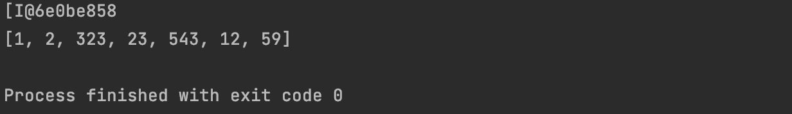

+ 此处的 Arrays.toString()方法是 Arrays 类的静态方法，不是前面讲的 Object 的 toString()方法。 


**Arrays.sort()对数组元素进行排序**

```java
int[ ] a = {1,2,323,23,543,12,59}; System.out.println(Arrays.toString(a)); 
Arrays.sort(a); 
System.out.println(Arrays.toString(a));
```

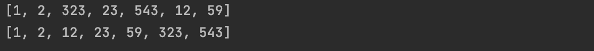


***binarySearch*(  ,  )实现二分法查找法**

使用二分法查找，必须先对数组进行排序，binarySearch方法返回排序后新的索引位置,若未找到返回负数。

```java
int[ ] a = {1,2,323,23,543,12,59}; 
Arrays.sort(a); //使用二分法查找，必须先对数组进行排序; 
System.out.println(Arrays.toString(a)); //返回排序后新的索引位置,若未找到返回负数
System.out.println("该元素的索引："+Arrays.binarySearch(a,12));
```


**Arrays.fill(  ,   ,    ,    )对数组进行填充**

Arrays.fill(填充数组, 起始位置, 结束位置, 填充字符)，如：Arrays.fill(a, 2, 4, 100)，**索引包头不包尾**，所以索引2-3填充为100.

```java
int[ ] a= {1,2,323,23,543,12,59}; System.out.println(Arrays.toString(a)); 
Arrays.fill(a, 2, 4, 100); //将2到4索引的元素替换为100; System.out.println(Arrays.toString(a));
```


### 5.多维数组

多维数组可以看成以数组为元素的数组。

#### 5.1二维数组的声明与初始化

**二维数组的声明**

```java
int[ ][ ] a = new int[3][ ]; //表示有3个一维数组
a[0] = new int[2]; 
a[1] = new int[4]; 
a[2] = new int[3];
// int[ ][ ] a1=new int[ ][4];//非法
```

**二维数组的静态初始化**

```java
int[ ][ ] a = { { 1, 2, 3 }, { 3, 4 }, { 3, 5, 6, 7 } }; System.out.println(a[2][3]);
```

**二维数组的动态初始化**

```java
int[ ][ ] a = new int[3][ ]; // a[0] = {1,2,5}; //错误，没有声明类型就初始化 
a[0] = new int[ ] { 1, 2 }; 
a[1] = new int[ ] { 2, 2 }; 
a[2] = new int[ ] { 2, 2, 3, 4 };
```


#### 5.2数组存储表格数据

**使用二维数组保存表格数据**

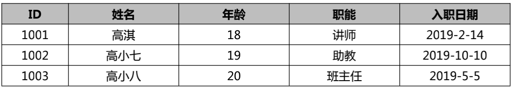

```java
public class Test04 {
    public static void main(String[] args) {
        //每个一维数组代表一行数据
        Object[ ] a1 = {1001,"高淇",18,"讲师","2019-2-14"};
        Object[ ] a2 = {1002,"高小七",19,"助教","2019-10-10"};
        Object[ ] a3 = {1003,"高小琴",20,"班主任","2019-5-5"};
        //此处基本数据类型”1001”，本质不是 Object 对象。JAVA 编译器会自动把基本数据类型“自动装箱”成包装类对象。
        Object[ ][ ] emps = new Object[3][ ];
        emps[0] = a1;
        emps[1] = a2;
        emps[2] = a3;
        //打印二维数组的内容（表格数据打印）
        for (int i=0;i<emps.length;i++){
            System.out.println(Arrays.toString(emps[i]));
        }
        //嵌套循环打印二维数组
        for (int i=0;i<emps.length;i++){
            for (int j=0;j<emps[i].length;j++){
                System.out.print(emps[i][j]+"\t");
            }
            System.out.println();
        }
    }
}
```

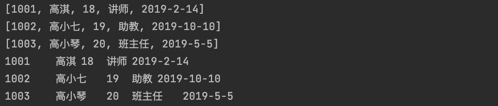


**使用 javabean 和一维数组保存表格信息**

```java
public class Test05 {
    public static void main(String[] args) {
        Emp emp0 = new Emp(1001,"高小六",18,"讲师","2019-2-14");
        Emp emp1 = new Emp(1002,"高小七",19,"助教","2019-10-10");
        Emp emp2 = new Emp(1003,"高小八",20,"主任","2019-5-5");

        Emp[] emps = new Emp[3];
        emps[0] = emp0;
        emps[1] = emp1;
        emps[2] = emp2;

        //遍历数据
        for (int i=0;i<emps.length;i++){
            System.out.println(emps[i]);//重写了ToString()方法
        }

    }

}

class Emp{
    private int id;
    private String name;
    private int age;
    private String job;
    private String hiredate;

    public Emp(){}

    public Emp(int id, String name, int age, String job, String hiredate) {
        this.id = id;
        this.name = name;
        this.age = age;
        this.job = job;
        this.hiredate = hiredate;
    }

    @Override
    public String toString() {
        return getId() +"\t"+getName() +"\t"+getAge()+"\t"+getJob()+"\t"+getHiredate();
    }

    public int getId() {
        return id;
    }

    public void setId(int id) {
        this.id = id;
    }

    public String getName() {
        return name;
    }

    public void setName(String name) {
        this.name = name;
    }

    public String getAge() {
        return age+"岁";
    }

    public void setAge(int age) {
        this.age = age;
    }

    public String getJob() {
        return job;
    }

    public void setJob(String job) {
        this.job = job;
    }

    public String getHiredate() {
        return hiredate;
    }

    public void setHiredate(String hiredate) {
        this.hiredate = hiredate;
    }
}
```


