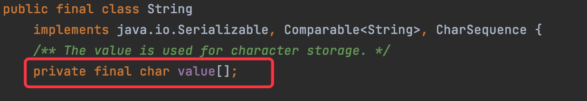

## Java基础


#### 递归

​		递归的基本思想就是“自己调用自己”，一个使用递归技术的方法将会直接或者间接的调用自己。利用递归可以用简单的程序来解决一些复杂的问题。比如：斐波那契数列的计算、汉诺塔、快排等问题。（递归算法虽然简单，但是耗时耗资源，栈内打开很多方法）

**递归结构包括两个部分：** 

+ **递归头**：递归的结束条件，什么时候不调用自身方法，避免陷入死循环。
+ **递归体**：什么时候需要调用自身方法。

```java
//递归阶乘
public class Recursion{
    static long factorial(int n){
        if(n==1){//递归头
            return 1;
        }
        else{//递归体
            return n*factorial(n-1);
        }
    }
}


//while循环计算10!阶乘
public class TestWhile {
    public static void main(String[] args) {
        int a = 5;
        int result = 1;
        while(a>1){
            result *= a*(a-1);
            a=a-2;
        }
        System.out.println(result);
    }
}
```


#### this 关键字

**对象创建的过程和 this 的本质**

​		构造方法是创建 Java 对象的重要途径，通过 new 关键字调用构造器时，构造器也确实返回该类的对象，但这个对象并不是完全由构造器负责创建。创建一个对象分为如下四步： 

1. 分配对象空间，并将对象成员变量初始化为 0 或空 
2. 执行属性值的显式初始化 
3. 执行构造方法 
4. 返回对象的地址给相关的变量 

​		**this 的本质就是“对象的地址” **，由于在构造方法调用前，对象已经创建。因此，在构造方法中也可以使用 this 代表“当前对象”。

+ 为避免产生二义性，应使用 this 来指明当前对象；普通方法中，this总是指向调用该方法的对象；构造方法中，this 总是指向正要初始化的对象。
+ 使用this关键字调用重载的构造方法，避免相同的初始化代码。但只能在构造方法中用，并且必须位于构造方法的第一句。
+ this 不能用于 static 方法中。（因为static属于类，this属于对象）

```java
//用户类
class User{
    int id;
    String name;
    String pwd;
    static String company = "BAT";//static定义静态属性

    //构造方法
    public User(int id,String name){
        this.id=id;
        this.name=name;
    }
  
  	//重载构造方法
    public User(int id,String name,String pwd){
        this(id,name);//构造方法调用另一个构造方法时，用this;在构造方法的第一句
        this.pwd=pwd;
    }
}
```


#### static 关键字

​		在类中，用 static 声明的成员变量为**静态成员变量**，也称为类变量。 类变量的生命周期和类相同，在整个应用程序执行期间都有效。它有如下特点： 

+ 为该类的公用变量，属于类，被该类的所有实例共享，在类被载入时被显式初始化。 
+ 对于该类的所有对象来说，static 成员变量只有一份，被该类的所有对象共享
+ 一般用“类名.类属性/方法”来调用。（也可以通过对象引用或类名（不需要实例化）访问静态成员。）

+ 在 static 方法中不可直接访问非 static 的成员。

```java
public class User { 
  	int id; // id 
  	String name; // 账户名 
  	String pwd; // 密码 
  	static String company = "北京尚学堂"; // 公司名称，static定义静态属性
  	public User(int id, String name) { 
      	this.id = id; 
      	this.name = name; 
    }
  	public void login() { 
      	System.out.println("登录：" + name); 
    }
  	public static void printCompany() { 
      	// login();//静态成员调用了非静态成员login()，编译就会报错 		
      	System.out.println(company); 
    }
  	public static void main(String[ ] args) { 
      	User u = new User(101, "高小七"); 
      	//”类名.类属性/方法“来调用属性和方法
      	User.printCompany();
      	User.company = "北京阿里爷爷"; 
      	User.printCompany(); 
    } 
}
```

 login()方法会在对象内，但是login()会在类内（方法区)

​		**普通属性、方法放在对象内（堆），静态成员变量在类内（方法区），普通成员方法、变量可以互相访问，静态成员方法、变量可以互相访问，普通成员方法可以访问静态方法变量（对象有了，肯定有对应类），但静态成员方法不能访问普通成员方法（对象不在类内、对象有很多或者只加载了类但是创建对象）（可以把类和对象的关系想象成汽车图纸和汽车的关系）**

这时回看一下变量的分类和作用域，会清晰一些。


#### final 关键字

final 关键字的作用：

+ **修饰变量:** 被他修饰的变量不可改变，一旦赋了初值，就不能被重新赋值。 

​		**final int MAX_SPEED = 120;** 

+ **修饰方法：**该方法不可被子类重写，但是可以被重载。

​		**final void study(){}** 

+ **修饰类:** 修饰的类不能被继承，比如：Math、String 等。 

​		**final class A {}** 


#### super 关键字

​		super可以看做是**直接父类对象的引用**。可以**通过 super 来访问父类中被子类覆盖的方法或属性**。使用 super 调用普通方法，语句没有位置限制，可以在子类中随便调用。 

```java
public class TestSuper01 { 
  public static void main(String[ ] args) { 
     new ChildClass().f(); 
  } 
}

class FatherClass { 
  public int value; 
  public void f(){ 
    value = 100;
    System.out.println ("FatherClass.value="+value);
	} 
}    

class ChildClass extends FatherClass { 
  public int value; 
  public void f() { 
    super.f(); //调用父类的普通方法 
    value = 200; 
    System.out.println("ChildClass.value="+value); 		
    System.out.println(value); 
    System.out.println(super.value); //调用父类的成员变量 
  } 
}
```


​		在一个类中，若是构造方法的第一行代码没有显式的调用 super(...)或者 this(...);那么 Java 默认都会调用 super()，**含义是调用父类的无参数构造方法**，这里的 super()可以省略。

```java
public class TestSuper02 {
		public static void main(String[ ] args) { 
      	System.out.println("开始创建一个ChildClass对象......"); 
      	new ChildClass(); 
    } 
}
class FatherClass { 
  	//父类构造方法
  	public FatherClass() { 
      	System.out.println("创建FatherClass"); 
    } 
  	public FatherClass(int a){
        System.out.println("创建FatherClass,带参数");
    }
}
class ChildClass extends FatherClass { 
  	//子类构造方法
  	public ChildClass() {
      	//super(); //所有的构造方法第一句总是super()，若不加，编译系统帮忙加
      	//super(3); //调用含参的构造方法
      	System.out.println("创建ChildClass"); 
    } 
}
```


上述程序执行涉及到**继承树追溯** 

**构造方法调用顺序：** 

​		构造方法第一句总是：super(…)来调用父类对应的构造方法。所以，流程就是：先向上追溯到 Object，然后再依次向下执行类的初始化块和构造方法，直到当前子类为止。

同样**属性/方法查找顺序**也是如此，先查找当前类，若没有再追溯父类直到 Object。


#### 重写override

子类通过重写父类的方法，用自身行为替代父类的行为，方法的重写是实现多态的必要条件。

重写的条件：

+ “= =”：方法名、形参列表相同
+ "<="：返回值类型和声明异常类型，子类小于等于父类
+ “>=” ：访问权限，子类要大于等于父类


## 封装

​		封装是把对象的属性和操作结合为一个独立的整体，并尽可能隐藏对象的内部实现细节。封装的要求是“高内聚，低耦合”，高内聚就是类的内部数据操作细节自己完成，不允许外部干涉；低耦合就是仅暴露少量的方法给外部使用，方便外部调用。

封装的优点：

+ 提高代码的安全性
+ 提高代码的复用性
+ 高内聚：封装细节，便于修改内部代码，提高可维护性
+ 低耦合：简化外部调用，便于调用者使用、拓展和协作

#### 封装的实现——访问控制符

Java 是使用访问控制符来控制哪些细节需要封装，哪些细节需要暴露的。 Java 有 4 种“访问控制符”分别为 private、default、protected、public，它们说明了面向对 象的封装性。


+ private 表示私有，只有自己类能访问

+ default 表示没有修饰符修饰，只有同一个包的类能访问

+ protected 表示可以被同一个包的类以及其他包中的子类访问

+ public 表示可以被该项目的所有包中的所有类访问


#### 封装的规则

1. 属性一般使用 private 访问权限，属性私有后， 提供相应的 get/set 方法来访问相关属性，这些方法通常是public 修饰的，以提供对属性的赋值与读取操作(注意:boolean 变量的 get方法是 is 开头)。
2. 方法：一些只用于本类的辅助性方法可以用 private 修饰，希望其他类调用的方法用 public 修饰。


## 多态

多态是指同一方法的调用，对象不同可能行为不同

+ 多态是方法的多态，不是属性的多态（多态和属性无关）
+ 多态的3个必要条件：继承、方法重写、父类引用指向子类对象
+ 父类引用指向子类对象后，用该父类引用调用重写的方法，多态就出现了

```java
public class text {
    static void animalCry(Animal a){
        a.shout();//多态
    }

    public static void main(String[] args) {
        Animal m = new Mouse();
        animalCry(m);
        Dog d = new Dog();
        animalCry(d);//Animal a = new Dog();
        animalCry(new Cat());//Animal a = new Cat();
    }
}
```

多态最常见的一种用法，即父类引用做方法的形参，实参可是任意子类对象，可以通过不同子类对象实现不同行为。多态的优势是提高了代码的可拓展性，但多态无法调用子类的特有功能。


#### 对象的转型

父类引用指向子类对象，我们称这个过程为**向上转型**，属于自动类型转换。 向上转型后的父类引用变量只能调用它编译类型的方法，不能调用它运行时类型的方法。这时，我们就需要进行类型的强制转换，我们称之为**向下转型**。

```java
Animal d = new Dog();//向上转换，可以自动转换。传的具体是哪一个类就调用哪一个类的方法。大大提高   了程序的可扩展性；d为编译类型，Dog对象才是运行时类型。
animalCry(d);//调用编译类型的方法
Dog d1 = (Dog) d;//强制类型转换
d1.seeDoor();//seeDoor()方法是Dog类特有的方法，必须进行强制类型转换，才能引用。
//Cat c1 = (Cat) d;这里向下强制转换的类型是Cat，但是真是子类是Dog，编写程序时不会报错，运行时报错
if(d instanceof Dog){
    Dog d1 = (Dog)d;
    d1.seeDoor();
}else if(d instanceof Cat){
    Cat c1 = (Cat)d;
    c1.eatMouse();
        }
```

在向下转型过程中，必须将引用变量转成真实的子类类型（运行时类型），否则会出现类型转换异常 ClassCastException。所以在向下转型时，可以使用instanceof来判断。


## 特殊类

### 抽象类

**抽象方法** ：使用 abstract 修饰的方法，没有方法体，只有声明。定义的是一种“规范”，就是告诉子类必须要给抽象方法提供具体的实现。

**抽象类**：包含抽象方法的类就是抽象类。通过 abstract 方法定义规范，然后要求子类必须定义具体实现。通过抽象类，我们就可以做到严格限制子类的设计，使子类之间更加通用。

```java
abstract class Animal {
    abstract public void shout();//抽象方法
}
class Dog extends Animal{
    //子类必须实现父类的抽象方法，否则编译错误
    public void shout(){
        System.out.println("汪汪汪");
    }
    public void seeDoor(){
        System.out.println("看门中....");
    }
}

//测试抽象类
public class TestAbstractClass {
    public static void main(String[ ] args) {
        Dog a = new Dog();
        a.shout();
        a.seeDoor();
    }
}
```

**抽象类的使用要点:** 

1. 有抽象方法的类只能定义成抽象类
2. **抽象类不能实例化**，即不能用 new 来实例化抽象类；抽象类可以包含属性、方法、构造方法，但是构造方法不能用来 new 实例，只能用来被子类调用
3. **抽象类只能用来被继承**
4. 抽象方法必须被子类实现


### 接口

​         接口就是规范，定义的是一组规则。接口就是比“抽象类”还“抽象”的“抽象类”，可以更加规范的对子类进行约束，全面地专业地实现了：**规范和具体实现的分离**。接口是两个模块之间通信的标准，通信的规范。

​         接口和实现类不是父子关系，是实现规则的关系。比如：我定义一个接口 Runnable， Car 实现它就能在地上跑。

#### 接口的定义

```
[访问修饰符] interface 接口名 [extends 父接口 1，父接口 2…] { 
     常量定义； 
     方法定义； 
}
```

**定义接口的详细说明：** 

+ **访问修饰符：**只能是 public 或默认。 

+ **接口名：**和类名采用相同命名机制。 

+ **extends：接口可以多继承**。 

+ **常量：**接口中的属性只能是常量，只能public static final修饰，默认为省略不写。 

+ **方法：**接口中的方法只能是public abstract修饰，默认为省略不写。 

**定义要点**

+ 实现类通过 **implements** 来实现接口中的规范，**一个类可以实现多接口**。 

+ 接口不能创建实例，但是可用于声明引用变量类型。 

+ 一个类实现了接口，必须实现接口中所有的方法，并且这些方法只能是 public 的。 

+ JDK1.8（不含 8）之前，接口中只能包含静态常量、抽象方法，不能有普通属性、构造方法、普通方法。 

+ **JDK1.8（含 8）后，接口中包含普通的静态方法、默认方法。**

```java
//这个是一个飞行器的接口
public interface Volent {
    /*public static final*/ int MAX_HIGHT = 100;//飞行器飞行的最大高度
    /*public abstract*/ void fly();//飞行方法，调用此方法飞行器可起飞
    void stop();//停止方法，在空中就悬停，在地上就静止
}

/**善良接口*/
interface Honest {
    void helpOther();
}

//实现类实现接口
public class Superman implements Volent,Honest{
    @Override
    public void fly() {
        System.out.println("横着飞");
    }

    @Override
    public void stop() {
        System.out.println("竖着停");
    }

    @Override
    public void helpOther() {
        System.out.println("助人为乐");
    }

    public static void main(String[] args) {
        Superman s = new Superman();
        s.fly();
        s.helpOther();

        Volent s1 = new Superman();
        s1.fly();
        Honest h1 = (Honest)s1;
        h1.helpOther();
    }
}
```


#### 接口定义中默认方法、静态方法（JDK8之后）

##### 默认方法（拓展方法）

​        用关键字**default**修饰接口中的非抽象方法，默认方法有方法体；抽象方法必须要被实现，默认方法不是必须实现，实现类可通过实现接口来调用或重写默认方法。

```java
public class Test { 
	public static void main(String[] args) { 
	A a = new Test_A(); 
	a.moren(); //调用的是重写后的方法
	}
}
interface A { 
	default void moren(){ 
		System.out.println("我是接口 A 中的默认方法！"); 
		} 
}
class Test_A implements A { 
	@Override 
	public void moren() { 
		System.out.println("Test_A.moren"); //重写接口中的默认方法
	} 
}
```

##### 静态方法

​        JAVA8 以后，可以在接口中直接定义静态方法的实现。这个静态方法直接从属于接口，可以通过**接口名调用**。 如果子类中定义了相同名字的静态方法，那就是完全不同的方法了，直接从属于子类，可以通过子类名直接调用。

```java
public class Test { 
  public static void main(String[] args) { 
    A.staticMethod(); 
    Test_A.staticMethod(); 
  } 
}
interface A { 
  public static void staticMethod(){
    System.out.println("A.staticMethod"); 
  } 
}
class Test_A implements A { 
  public static void staticMethod(){
    System.out.println("Test_A.staticMethod"); 
  } 
}
```

默认方法是普通方法，要实现类才能调用；静态方法可由接口名直接调用；**默认方法中可以调用静态方法**。


### 内部类

​		一般情况，我们把类定义成独立的单元。有些情况下，我们把一个类放在另一个类的内部定义，称为内部类(innerclasses)。内部类可以使用 public、default、protected 、private 以及 static 修饰。而外部顶级类（我们以前接触的类）只能使用 public 和 default 修饰。

​		内部类只是一个编译时概念，一旦我们编译成功，就会成为完全不同的两个类。

```java
//外部类
public class Outer1 {
    private int age = 10;
    private void show(){
        System.out.println("你好,Outer");
    }
    //内部类（可以用public或private修饰，看需求）
    public class Inner1{
        private String name = "Tom";
        //可以声明和外部类同名的属性和方法
        private int age = 20;
        public void showInner(){
            System.out.println("你好，Inner");
            System.out.println(age);
            System.out.println(Outer1.this.age);//当外部类和内部类属性重名时，可通过Outer.this.属性名
            show();//内部类可以直接使用外部类的成员
        }
    }

    public static void main(String[] args) {
        Outer1.Inner1 inner1 = new Outer1().new Inner1();
        inner1.showInner();

        Outer1 outer2 = new Outer1();
        Inner1 inner2 = outer2.new Inner1();
        inner2.showInner();
    }
}
```

**内部类的作用：** 

+ 内部类提供了更好的封装。只能让外部类直接访问，不允许同一个包中的其他类直接访问。 

+ 内部类可以直接访问外部类的私有属性，内部类被当成其外部类的成员。 但外部类不能访问内部类的内部属性。 


#### 内部类的分类


##### 1.非静态内部类 （外部类里使用非静态内部类和平时使用其他类没什么不同）

上面写的内部类就是非静态内部类

1. 非静态内部类对象必须寄存在一个外部类对象里。非静态内部类对象单独属于外部类的某个对象。 
2. 非静态内部类可以直接访问外部类的成员，但是外部类不能直接访问非静态内部类成员。 
3. 非静态内部类不能有静态方法、静态属性和静态初始化块。 
4. **成员变量访问要点：** 
   1. 内部类里方法的局部变量：变量名。
   2. 内部类属性：this.变量名。 
   3. 外部类属性：外部类名.this.变量名。 


##### 2.静态内部类

定义语法

```java
static class ClassName{
//类体 
}
```

**使用要点：** 

1.  静态内部类可以访问外部类的静态成员，不能访问外部类的普通成员。 

2.  静态内部类看做外部类的一个静态成员。 


##### 3.匿名内部类

​		适合那种只需要使用一次的类。比如：键盘监听操作等等。在安卓开发、awt、swing开发中常见。

定义语法

```
new 父类构造器(实参类表) / 实现接口 () { 
//匿名内部类类体！ 
}
```

```java
//测试匿名内部类
public class TestAnonymousInnerClass {
    public void test(A a){
        a.run();
    }

    public static void main(String[] args) {
        TestAnonymousInnerClass tai = new TestAnonymousInnerClass();
        //匿名内部类调用一次定义一次，每次都是新的
        tai.test(new A(){
            @Override
            public void run() {
                System.out.println("匿名内部类测试! 我是新定义的 第一个匿名内部类");
            }
        });

        tai.test(new A(){
            @Override
            public void run() {
                System.out.println("匿名内部类测试! 我是新定义的 第二个匿名内部类");
            }
        });

        //实现类
        tai.test(new AA());


    }
}

//实现类，有名字的类可反复使用
class AA implements A{
    @Override
    public void run() {
        System.out.println("外部定义的类可反复用");
    }
}

interface A{
    void run();
}
```

**使用要点：** 

1.  匿名内部类没有访问修饰符。

2. 匿名内部类没有构造方法，因为它连名字都没有


##### 4.局部内部类 

​		定义在方法内部的，作用域只限于本方法，称为局部内部类。局部内部类的的使用主要是用来解决比较复杂的问题，想创建一个类来辅助我们的解决方案，到那时又不希望这个类是公共可用的，所以就产生了局部内部类。局部内部类和成员内部类一样被编译，只是它的作用域发生了改变，它只能在该方法中被使用，出了该方法就会失效。

```java
//测试局部内部类
public class TestLocalInnerClass { 
  public void show() { 
    //作用域仅限于该方法 
    class Inner3 { 
      public void fun() { 
        System.out.println("helloworld"); 
      } 
    }
    new Inner3().fun(); 
  }
  public static void main(String[ ] args) { 
    new TestLocalInnerClass().show(); 
  } 
}
```


## 字符串 String 类

​		String 类又称作不可变字符序列,String 位于 java.lang 包中，Java 程序默认导入 java.lang 包下的所有类，Java 字符串就是 **Unicode 字符序列**，例如字串“Java”就是 4 个 Unicode 字符’J’、’a’、’v’、’a’组成的。Java 没有内置的字符串类型，而是在标准 Java 类库中提供了一个预定义的类 。

​		String，每个用双引号括起来的字符串都是 String 类的一个实例。

创建String对象

```java
String s1 = new String("abc");
String s2 = "abc";
```

字符串连接,使用“+”，当"+"运算符两侧的操作数中只要有一个是字符串(String)类型，系统会自动将另一个操作数转换为字符串然后再进行连接。 

```java
String s1 = new String("abc");
String s2 = "abc";
String s3 = s1+s2;
System.out.println(s3);//abcabc

int age = 18;
System.out.println("age is "+age);//age is 18
```

字符串相等比较

```java
String s1 = new String("abc");
String s2 = "abc";
String s3 = "abc";
System.out.println(s1==s2);//false//比较的是两者的地址,对象不同
System.out.println(s2==s3);//true
//涉及到字符串比较时，一般用equals方法
System.out.println(s1.equals(s2));//true
```

#### String的方法


**String是不可变字符序列，所有替换、截取、去空格等都不会影响原字符串，都会重新生成新字符串。**


## 数组

​		数组是相同类型数据的有序集合，每一个数据称作一个元素，每个元素可以通过一个索引（下标）来访问它们。

+ 数组长度是确定的。数组一旦被创建，它的大小就是不可以改变的。
+ 其元素的类型必须是相同类型，不允许出现混合类型。
+ 数组类型可以是任何数据类型，包括基本类型和引用类型。 
+ 数组变量属于引用类型，数组也是对象，数组中的每个元素相当于该对象的成员变量。（Java 中对象是在堆中的，因此数组无论保存原始类型还是其他对象类型，数组对象本身是在堆中存储的）

### 1. 创建数组和初始化

数组的声明（一维数组）

```java
type[] array_name;//方式一（推荐）
type array_name[];//方式二
```

+ 声明的时候并没有实例化任何对象，数组没有被真正创建，只有在实例化数组对象时，JVM 才分配空间，这时才与长度有关。
+ 构造一个数组，必须指定长度。

#### 创建基本类型一维数组

```java
public class Test { 
  public static void main(String args[ ]) { 
    int[ ] s = null; // 声明数组； 
    s = new int[10]; // 给数组分配空间； 
    for (int i = 0; i < 10; i++) { 
      s[i] = 2 * i + 1;//给数组元素赋值； 数组是对象，数组中的元素就是对象的属性 
      System.out.println(s[i]); 
    } 
  } 
}
```


#### 创建引用类型一维数组

```java
class Man{ 
  private int age; 
  private int id; 
  public Man(int id,int age) { 
    super();
    this.age = age;
    this.id = id; 
  } 
}
public class AppMain { 
  public static void main(String[ ] args) { 
    Man[ ] mans; //声明引用类型数组； 
    mans = new Man[10]; //给引用类型数组分配空间； 
    
    Man m1 = new Man(1,11); 
    Man m2 = new Man(2,22); 
    
    mans[0]=m1;//给引用类型数组元素赋值； 
    mans[1]=m2;//给引用类型数组元素赋值； 
  } 
}
```


#### 数组的初始化

数组的初始化方式总共有三种：静态初始化、动态初始化、默认初始化。

##### 1.静态初始化

​		除了用 new 关键字来产生数组以外，还可以直接在定义数组的同时就为数组元素分配空间并赋值。

```java
int[ ] a = { 1, 2, 3 };// 静态初始化基本类型数组
Man[ ] mans = { new Man(1, 1), new Man(2, 2) };// 静态初始化引用类型数组
```

##### 2.动态初始化

​		数组定义与为数组元素分配空间并赋值的操作分开进行。 

```java
int[ ] a1 = new int[2];//动态初始化数组，先分配空间； 
a1[0]=1;//给数组元素赋值； 
a1[1]=2;//给数组元素赋值；
```

##### 3.默认初始化

​		数组是引用类型，它的元素相当于类的实例变量，因此数组一经分配空间，其中的每个元素也被按照实例变量同样的方式被隐式初始化。

```java
int[] a2 = new int[2]; // 默认值：0,0 
boolean[ ] b = new boolean[2]; // 默认值：false,false 
String[ ] s = new String[2]; // 默认值：null, null
```


### 2. 数组的遍历

#### 使用循环初始化和遍历数组

```java
int[] arr1 = new int[5];
for (int i=0;i<arr1.length;i++){
    arr1[i]=i*2+1;
}
for (int i=0;i<arr1.length;i++){  //索引范围[0,length-1]
		System.out.println(arr1[i]);
}
```

#### for-each 循环（用于读取）

​		增强for循环for-each是 JDK1.5 新增加的功能，**专门用于读取数组或集合中所有的元素**，即对数组进行遍历。

​		for-each循环不涉及有关索引（下标）的操作，所以不能修改数组中某元素的值，仅用于读取。 

```java
Man[] mans =  {
  			new Man(01,"Tom"),
        new Man(02,"Tim"),
        new Man(03,"Ross"),
        new Man(04,"Jerry"),
        new Man(05,"Bin")
        };
//增强for循环
for (Man m:mans){
		System.out.println(m);
}
//和上面一样
for (int i=0;i<mans.length;i++){
		Man m = mans[i];
		System.out.println(m);
}
```


### 3. 数组的拷贝

System 类里也包含了一个 static void arraycopy（**object src：原数组，int srcpos：原数组起始位置，object dest：目标数组， int destpos：目标数组的起始位置，int length：拷贝长度**）方法，该方法可以将 src 数组里的元素值赋给 dest 数组的元素，其中 srcpos 指定从 src 数组的第几个元素开始赋值，length 参数指定将 src 数组的多少个元素赋给 dest 数组的元素。

```java
public class Arraycopy {
    public static void main(String[] args) {
        String[] s1 = {"Tom","Tim","Ross","Jenny","Danny"};
        String[] s2 = new String[6];
        System.arraycopy(s1,0,s2,0,s1.length);
        for(String s3:s2){
            System.out.print(s3+"\t");
        }
    }
}
//运行结果：Tom	Tim	Ross	Jenny	Danny	null
```


### 4. java.util.Arrays 类

​		JDK 提供的 java.util.Arrays 类提供了常用的数组操作工具，方便我们日常开发。Arrays类包含了：排序、查找、填充、打印内容等常见的方法。

**Arrays.toString()输出数组中的元素**

```java
import java.util.Arrays;

int[ ] a = {1,2,323,23,543,12,59};
System.out.println(a); // 打印数组引用的值
System.out.println(Arrays.toString(a)); // 打印数组元素的值；
```


+ 此处的 Arrays.toString()方法是 Arrays 类的静态方法，不是前面讲的 Object 的 toString()方法。 


**Arrays.sort()对数组元素进行排序**

```java
int[ ] a = {1,2,323,23,543,12,59}; System.out.println(Arrays.toString(a)); 
Arrays.sort(a); 
System.out.println(Arrays.toString(a));
```


***binarySearch*(  ,  )实现二分法查找法**

使用二分法查找，必须先对数组进行排序，binarySearch方法返回排序后新的索引位置,若未找到返回负数。

```java
int[ ] a = {1,2,323,23,543,12,59}; 
Arrays.sort(a); //使用二分法查找，必须先对数组进行排序; 
System.out.println(Arrays.toString(a)); //返回排序后新的索引位置,若未找到返回负数
System.out.println("该元素的索引："+Arrays.binarySearch(a,12));
```


**Arrays.fill(  ,   ,    ,    )对数组进行填充**

Arrays.fill(填充数组, 起始位置, 结束位置, 填充字符)，如：Arrays.fill(a, 2, 4, 100)，**索引包头不包尾**，所以索引2-3填充为100.

```java
int[ ] a= {1,2,323,23,543,12,59}; System.out.println(Arrays.toString(a)); 
Arrays.fill(a, 2, 4, 100); //将2到4索引的元素替换为100; System.out.println(Arrays.toString(a));
```


#### Comparable 接口

​		**某个类的对象**之间做比较，就需要实现 Comparable 接口。接口中只有一个方法 compareTo，这个方法定义了对象之间的比较规则。 依据这个“比较规则”，我们就能对 所有对象实现排序。

​		Comparable 接口中只有一个方法： public int compareTo(Object obj)， obj 为要比较的对象 ，将当前对象和 obj 这个对象进行比较，如果大于返回 1，等于返回 0，小于返 回-1。(此处的1也可以是正整数，-1也可以是负整数)。compareTo方法的代码也比较固定，模式如下（比较年龄）：

```java
public int compareTo(Object o) { 
  Man man = (Man) o; 
  if (this.age < man.age) { 
    return -1; 
  }
  if (this.age > man.age) { 
    return 1; 
  }
  return 0; 
}
```

**使用 Arrays 类对数组元素进行排序** 

```java
import java.util.Arrays;

public class Test06 {
    public static void main(String[] args) {
        Man2[ ] msMans = {
                new Man2(3, "a"),
                new Man2(60, "b"),
                new Man2(2, "c")
        };
        Arrays.sort(msMans);
        System.out.println(Arrays.toString(msMans));
    }
}

class Man2 implements Comparable{
    int age;
    int id;
    String name;

    public Man2(int age, String name) {
        super();
        this.age = age;
        this.name = name;
    }

    public String toString() {
        return this.name;
    }

    public int compareTo(Object o) {
        Man2 man2 = (Man2) o;
        if (this.age < man2.age) {
            return -1;
        }
        if (this.age > man2.age) {
            return 1;
        }
        return 0;
    }
}
```


### 5.多维数组

多维数组可以看成以数组为元素的数组。

#### 5.1二维数组的声明与初始化

**二维数组的声明**

```java
int[ ][ ] a = new int[3][ ]; //表示有3个一维数组
a[0] = new int[2]; 
a[1] = new int[4]; 
a[2] = new int[3];
// int[ ][ ] a1=new int[ ][4];//非法
```

**二维数组的静态初始化**

```java
int[ ][ ] a = { { 1, 2, 3 }, { 3, 4 }, { 3, 5, 6, 7 } }; System.out.println(a[2][3]);
```

**二维数组的动态初始化**

```java
int[ ][ ] a = new int[3][ ]; // a[0] = {1,2,5}; //错误，没有声明类型就初始化 
a[0] = new int[ ] { 1, 2 }; 
a[1] = new int[ ] { 2, 2 }; 
a[2] = new int[ ] { 2, 2, 3, 4 };
```


#### 5.2数组存储表格数据

**使用二维数组保存表格数据**


```java
public class Test04 {
    public static void main(String[] args) {
        //每个一维数组代表一行数据
        Object[ ] a1 = {1001,"高淇",18,"讲师","2019-2-14"};
        Object[ ] a2 = {1002,"高小七",19,"助教","2019-10-10"};
        Object[ ] a3 = {1003,"高小琴",20,"班主任","2019-5-5"};
        //此处基本数据类型”1001”，本质不是 Object 对象。JAVA 编译器会自动把基本数据类型“自动装箱”成包装类对象。
        Object[ ][ ] emps = new Object[3][ ];
        emps[0] = a1;
        emps[1] = a2;
        emps[2] = a3;
        //打印二维数组的内容（表格数据打印）
        for (int i=0;i<emps.length;i++){
            System.out.println(Arrays.toString(emps[i]));
        }
        //嵌套循环打印二维数组
        for (int i=0;i<emps.length;i++){
            for (int j=0;j<emps[i].length;j++){
                System.out.print(emps[i][j]+"\t");
            }
            System.out.println();
        }
    }
}
```

**上面程序中基本数据类型”1001”，本质不是 Object 对象。JAVA 编译器会自动把基本数据类型“自动装箱”成包装类对象。**


**使用 javabean 和一维数组保存表格信息**

```java
public class Test05 {
    public static void main(String[] args) {
        Emp emp0 = new Emp(1001,"高小六",18,"讲师","2019-2-14");
        Emp emp1 = new Emp(1002,"高小七",19,"助教","2019-10-10");
        Emp emp2 = new Emp(1003,"高小八",20,"主任","2019-5-5");

        Emp[] emps = new Emp[3];
        emps[0] = emp0;
        emps[1] = emp1;
        emps[2] = emp2;

        //遍历数据
        for (int i=0;i<emps.length;i++){
            System.out.println(emps[i]);//重写了ToString()方法
        }

    }

}

class Emp{
    private int id;
    private String name;
    private int age;
    private String job;
    private String hiredate;

    public Emp(){}

    public Emp(int id, String name, int age, String job, String hiredate) {
        this.id = id;
        this.name = name;
        this.age = age;
        this.job = job;
        this.hiredate = hiredate;
    }

    @Override
    public String toString() {
        return getId() +"\t"+getName() +"\t"+getAge()+"\t"+getJob()+"\t"+getHiredate();
    }

    public int getId() {
        return id;
    }

    public void setId(int id) {
        this.id = id;
    }

    public String getName() {
        return name;
    }

    public void setName(String name) {
        this.name = name;
    }

    public String getAge() {
        return age+"岁";
    }

    public void setAge(int age) {
        this.age = age;
    }

    public String getJob() {
        return job;
    }

    public void setJob(String job) {
        this.job = job;
    }

    public String getHiredate() {
        return hiredate;
    }

    public void setHiredate(String hiredate) {
        this.hiredate = hiredate;
    }
}
```


## 常用类

### 1.基本数据类型的包装类

​		八种基本数据类型并不是对象，但是我们在实际应用中经常需要将基本数据转化成对象，以便于操作。比如：将基本数据类型存储到 Object[ ]数组或集合中的操作等等。为了将基本类型数据和对象之间实现互相转化，JDK 为每一个基本数据类型提供了相应的包装类(Wrapper Class)。包装类均位于 java.lang 包。


​		在这八个类中，除了 Character 和 Boolean 以外，其他的都是“数字型”，**“数字型”都是 java.lang.Number 的子类**。


​		Number 类是抽象类(Number的源码：`public abstract class Number implements java.io.Serializable`)，因此它的抽象方法，所有子类都需要提供实现。Number 类提供了抽象方法：intValue()、longValue()、floatValue()、doubleValue()，意味着所有的“数字型”包装类都可以互相转型。 


#### 1.1包装类的使用与作用

**对于包装类来说，这些类的用途主要包含两种：** 

1. 基本数据类型转换为对象（或包装类对象转换为基本数据类型），方便涉及到对象的操作，如 Object[ ]、集合等的操作。 
2. 包含每种基本数据类型的相关属性如最大值、最小值等，以及相关的操作方法（这些操作方法的作用是在**<u>基本数据类型、包装类对象、字符串之间提供相互之间的转化</u>**）。

**八种基本数据类型用法一样，所以以Integer类为例**

```java
//基本数据类型转换为对象
Integer i1 = new Integer(20); //从java9开始被废弃，不推荐使用
Integer i2 = Integer.valueOf(20); // 推荐

//包装类对象转换为基本数据类型
double d = i2.doubleValue();

//数字字符串转换为包装类对象
Integer i3 = Integer.valueOf("123");
Integer i4 = Integer.parseInt("123");

//包装类对象转换成字符串
String s = i3.toString();

//一些常用的常量
System.out.println("int能表示最大的整数"+Integer.MAX_VALUE);
System.out.println("int能表示最小的整数"+Integer.MIN_VALUE);
```

**自动装箱和拆箱**

​		自动装箱和拆箱就是将基本数据类型和包装类之间进行自动的互相转换。JDK1.5 后， Java 引入了自动装箱(autoboxing)/拆箱(unboxing)。

​		自动装箱过程是通过调用包装类的 valueOf()方法实现的，而自动拆箱过程是通过调用包装类的 xxxValue()方法实现的（xxx 代表对应的基本数据类型，如 intValue()、 doubleValue()等）。

```java
//自动装箱
Integer a = 300;//编译器自动帮你改为:Integer i = Integer.valueOf(300);

//自动拆箱
int b = a;//编译器自动帮你改为:int b = a.intValue(); //a为一个对象

//包装类空指针异常问题
Integer i = null;
int j = i; //编译器帮你改为：int j = i.intValue(); //c为空，无法调用方法
           //java.lang.NullPointerException 对象为null，无法调用方法
```


#### 1.2包装类的缓存问题

​		整型、char类型所对应的包装类，在自动装箱时，对于-128~127之间的值会进行缓存处理，其目的是提高效率。 

​		缓存处理的原理为：如果数据在-128~127这个区间，那么在类加载时就已经为该区间的每个数值创建了对象，并将这256个对象存放到一个名为cache的数组中。每当自动装箱过程发生时（或者手动调用valueOf()时），就会先判断数据是否在该区间，**如果在则直接获取数组中对应的包装类对象的引用，如果不在该区间，则会通过new调用包装类的构造方法来创建对象**。

```java
//包装类的缓存问题
Integer d1 = 1234;
Integer d2 = 1234;
Integer d3 = 123;
Integer d4 = 123; //自动装箱，调用Integer.valueOf(123)

System.out.println(d1==d2);//false 3000不在缓存中，所以要创建了两个不同对象
System.out.println(d3==d4);//true  Integer类的缓存问题
System.out.println(d1.equals(d2));//true  比的是值
```

```java
//valueOf（）源码
public static Integer valueOf(int i) {
		if (i >= IntegerCache.low && i <= IntegerCache.high)
				return IntegerCache.cache[i + (-IntegerCache.low)];//若在-128~127区间，直接返回缓存数组中的某个元素
		return new Integer(i);
}
//IntegerCache类为Integer类的一个静态内部类，仅供Integer类使用；IntegerCache.low为-128，IntegerCache.high为127

//equals()源码
public boolean equals(Object obj) {
		if (obj instanceof Integer) {
				return value == ((Integer)obj).intValue();
    }
    return false;
}
```


#### 1.3自定义一个简单的包装类(MyInteger包装类)

```java
public class MyInteger {
    private int value;
    private static MyInteger[] cache = new MyInteger[256];

    public static final int LOW = -128;
    public static final int HIGH = 127;

    static {
        //缓存[-128,127]
        for(int i=LOW;i<=HIGH;i++){
            //-128,0;-127,1
            cache[i+128] = MyInteger.valueOf(i);

        }
    }

    public static MyInteger valueOf(int i){
        if(i>=LOW&&i<=HIGH){
            return cache[i+128];
        }
        return new MyInteger(i);
    }

    public int intValue(){
        return value;
    }

    @Override
    //要想打印时返回数字，重写toString()，否则返回地址
    public String toString() {
        return this.value+"";//+""可使数字转字符串
    }

    private MyInteger(int i){
        this.value=i;
    }

    public static void main(String[] args) {
        MyInteger m = MyInteger.valueOf(300);
        System.out.println(m);

        MyInteger m1 = MyInteger.valueOf(123);
        MyInteger m2 = MyInteger.valueOf(123);
        MyInteger m3 = MyInteger.valueOf(1233);
        MyInteger m4 = MyInteger.valueOf(1233);
        int m5 = m3.intValue();

        System.out.println(m1==m2);
        System.out.println(m3==m4);
        System.out.println(m5);
    }
}
```


### 2.字符串相关类

​		String 类、StringBuilder 类、StringBuffer 类是三个字符串相关类。String 类是的对象代表不可变的字符序列，StringBuilder 类和 StringBuffer 类代表可变字符序列。

#### 2.1 String 类

**String 类源码分析**



​		字符串内容全部存储到 value[ ]数组中，而变量 value 是 final 类型的，也就是常量(即只能被赋值一次)，这就是“不可变对象”的典型定义方式。String 的一些方法，比如：substring()是对字符串的截取操作，就是产生新的字符串，不改变原字符串。

**字符串常量拼接时的优化**

​		在遇到字符串常量之间的拼接时，编译器会做出优化，即在编译期间就会完成字符串的拼接。

```java
public class TestString2 { 
		public static void main(String[ ] args) {
      	//编译器做了优化,直接在编译的时候将字符串进行拼接
      	String str1 = "hello" + " java";//相当于 str1 = "hello java"	     
      	String str2 = "hellojava"; 
      	System.out.println(str1 == str2);//true 
      	String str3 = "hello"; 
      	String str4 = " java"; //编译的时候不知道变量中存储的是什么,所以没办法在编译的时候优化
      	String str5 = str3 + str4; 
      	System.out.println(str2 == str5);//false	
		} 
}      
```

#### 2.2 StringBuffer 和 StringBuilder类

​		StringBuffer 和 StringBuilder 非常类似，均代表可变的字符序列。 这两个类都是抽象类AbstractStringBuilder的子类，方法几乎一模一样。

AbstractStringBuilder的源码


​		内部也是一个字符数组，但这个字符数组没有用final修饰，随时可以修改。因此，StringBuilder和StringBuffer为“可变字符序列”。

两者区别：

+ StringBuffer JDK1.0 版本提供的类，**线程安全，做线程同步检查， 效率较低**。 

+ StringBuilder JDK1.5 版本提供的类，**线程不安全，不做线程同步检查，因此效率较高，建议采用该类。**

**常用方法列表：** 

1. 重载的 public StringBuilder append(…)方法 

​		可以为该 StringBuilder 对象添加字符序列，**仍然返回自身对象**。 

2. 方法 public StringBuilder delete(int start,int end) 

​		可以删除从 start 开始到 end-1 为止的一段字符序列，**仍然返回自身对象**。 

3. 方法 public StringBuilder deleteCharAt(int index) 

​		移除此序列指定位置上的 char，仍然返回自身对象。 

4. 重载的 public StringBuilder insert(…)方法 

   可以为该 StringBuilder 对象在指定位置插入字符序列，**仍然返回自身对象**。 

5. 方法 public StringBuilder reverse() 

   用于将字符序列逆序，仍然返回自身对象。 

6. 方法 public String toString() 返回此序列中数据的字符串表示形式。 

```java
public class TestStringBufferAndBuilder{
    public static void main(String[ ] args) {
        /**StringBuilder*/
        StringBuilder sb = new StringBuilder();
        for (int i = 0; i < 7; i++) {
            sb.append((char) ('a' + i));//追加单个字符
        }
        System.out.println(sb);//转换成 String 输出
        sb.append(", I can sing my abc!");//追加字符串
        System.out.println(sb.toString());
        //StringBuffer，下面的方法同样适用 StringBuilder
        StringBuffer sb2 = new StringBuffer("计算机编程");
        sb2.insert(0, "爱").insert(0, "我");//插入字符串
        System.out.println(sb2);
        sb2.delete(0, 2);//删除子字符串
        System.out.println(sb2);
        sb2.deleteCharAt(0).deleteCharAt(0);//删除某个字符
        System.out.println(sb2.charAt(0));//获取某个字符
        System.out.println(sb2.reverse());//字符串逆序
    }
}
```


#### 2.3 不可变和可变字符序列使用陷阱

**String 使用的陷阱** 

​		String 一经初始化后，就不会再改变其内容了。对 String 字符串的操作作实际上是对其副本（原始拷贝）的操作，原字符串不改变，会产生新的字符串。如果多次执行这些改变串内容的操作，会导致大量副本字符串对象存留在内存中，降低效率。如果这样的操作放到循环中，会极大影响程序的时间和空间性能，甚至会造成服务器的崩溃。 

​		相反，StringBuilder 和 StringBuffer 类是对原字符串本身操作的，可以对字符串进行修改而不产生副本拷贝或者产生少量的副本。因此可以在循环中使用。

```java
public class TestString2 {
    public static void main(String[ ] args) {
        /*使用String进行字符串的拼接*/
        String str8 = "";
        //本质上使用StringBuilder拼接, 但是每次循环都会生成一个StringBuilder对象
        long num1 = Runtime.getRuntime().freeMemory();//获取系统剩余内存空间
        long time1 = System.currentTimeMillis();//获取系统的当前时间
        for (int i = 0; i < 3000; i++) {
            str8 = str8 + i;//相当于产生了500个对象
        }
        long num2 = Runtime.getRuntime().freeMemory();
        long time2 = System.currentTimeMillis();
        System.out.println("String占用内存 : " + (num1 - num2));
        System.out.println("String占用时间 : " + (time2 - time1));
        /*使用StringBuilder进行字符串的拼接*/
        StringBuilder sb1 = new StringBuilder("");
        long num3 = Runtime.getRuntime().freeMemory();
        long time3 = System.currentTimeMillis();
        for (int i = 0; i < 3000; i++) {
            sb1.append(i);
        }
        long num4 = Runtime.getRuntime().freeMemory();
        long time4 = System.currentTimeMillis();
        System.out.println("StringBuilder占用内存 : " + (num3 - num4));
        System.out.println("StringBuilder占用时间 : " + (time4 - time3));
    }
}
```


 

### 3.时间处理相关类

​		在计算机世界，我们把 1970 年 1 月 1 日 00:00:00 定为基准时间，每个度量单位是毫秒(1 秒的千分之一)。

用 long 类型的变量来表示时间，得现在时刻的“时刻数值”：

`long now = System.currentTimeMillis();`

```java
long a =Long.MAX_VALUE/(1000L*3600*24*365);
System.out.println(a);//大约表示到2.9亿年后

long nowMum = System.currentTimeMillis();//代表当前时刻的毫秒数
System.out.println(nowMum);
```


#### 3.1 Date 时间类(java.util.Date)

在标准 Java 类库中包含一个 Date 类。它的对象表示一个特定的瞬间，精确到毫秒。  

+ Date() 分配一个 Date 对象，并初始化此对象为系统当前的日期和时间，可以精确到毫秒）。 
+ Date(long date) 分配 Date 对象并初始化此对象，以表示自从标准基准时间（称为“历元（epoch）”，即 1970 年 1 月 1 日 00:00:00 GMT）以来的指定毫秒数。 
+ long getTime() 返回自 1970 年 1 月 1 日 00:00:00 GMT 以来此 Date 对象表示的毫秒数。
+ boolean after(Date when) 测试此日期是否在指定日期之后。
+  booleanbefore(Date when) 测试此日期是否在指定日期之前。 
+ boolean equals(Object obj) 比较两个日期的相等性。

```java
import java.util.Date;

public class TestDate {
    public static void main(String[] args) {
      	long a =Long.MAX_VALUE/(1000L*3600*24*365);
				System.out.println(a);//大约表示到2.9亿年后

				long nowMum = System.currentTimeMillis();//代表当前时刻的毫秒数
				System.out.println(nowMum);
      
        Date d1 = new Date(); //没有传参，代表当前时刻
        System.out.println(d1);
        System.out.println(d1.getTime());//d1的秒数（以1970年为基准）

        Date d2 = new Date(1000L*3600*24*365*250); //有参数
        System.out.println(d2);
    }
}
```


​		现在Date 类中的很多方法都已经过时了。JDK1.1 之前的Date 包含了：日期操作、字符串转化成时间对象等操作。JDK1.1 之后，日期操作一般使用Calendar 类，而字符串的转化使用DateFormat类。 

#### 3.2 DateFormat 类和 SimpleDateFormat 类

**DateFormat 类的作用**

​		**把时间对象转化成指定格式的字符串，或把指定格式的字符串转化成时间对象**。DateFormat 是一个抽象类，一般使用它的的子类 SimpleDateFormat 类来实现。

```java
import java.text.ParseException;
import java.text.SimpleDateFormat;
import java.util.Date;

public class TestDateFormat {
    public static void main(String[] args) throws ParseException {
        //new出SimpleDateFormat对象,用于调用parse()和format()方法，以及规定日期格式
        SimpleDateFormat df = new SimpleDateFormat("yyyy-MM-dd hh:mm:ss");//指定字符串的格式,格式可以换但格式要统一
        SimpleDateFormat df3 = new SimpleDateFormat("yyyy年MM月dd日 hh时mm分ss秒");

        //字符串转化为Date对象
        Date d1 = df.parse("2021-01-01 01:02:03");
        System.out.println(d1.getTime());

        Date d3 = df3.parse("2022年01月01日 0时1分2秒");
        System.out.println(d3.getTime());

        //Date对象转化为字符串
        Date d2 = new Date();//无参表现在时刻
        String s2 = df.format(d2);
        System.out.println(s2);

        //输出第几周、第几天
        SimpleDateFormat df4 = new SimpleDateFormat("今年的第w周,今年第D天");
        System.out.println(df4.format(new Date()));
    }
}
```

代码中的格式化字符的具体含义


#### 3.3 Calendar 日历类

​		Calendar 类是一个抽象类，为我们提供了关于**日期计算**的相关功能，比如：年、月、日、时、分、秒的展示和计算。GregorianCalendar 是 Calendar 的一个具体子类，提供了世界上大多数国家/地区使用的标准日历系统。 

​		注意：月份的表示，一月是 0，二月是 1，以此类推，12 月是 11。 因为大多数人习惯于使用单词而不是使用数字来表示月份，这样程序也许更易读，父类 Calendar 使用常量来表示月份：JANUARY、FEBRUARY 等等。 

```java
import java.util.Calendar;
import java.util.Date;
import java.util.GregorianCalendar;

public class TestCalendar {
    public static void main(String[] args) {
        GregorianCalendar calendar = new GregorianCalendar(2021, 11, 1, 22, 10, 50);
        //取值用get()方法
        int year = calendar.get(Calendar.YEAR); // 打印：2021
        int month = calendar.get(Calendar.MONTH);//打印：12
        int day = calendar.get(Calendar.DAY_OF_MONTH);// 日：Calendar.DATE 和 Calendar.DAY_OF_MONTH 同义
        int date = calendar.get(Calendar.DAY_OF_WEEK); // 一周的第几天
        // 星期几 这里是：1-7.周日是 1，周一是 2 ...周六是 7
        System.out.println(year);
        System.out.println(month);
        System.out.println(day);
        System.out.println(date);

        //设置日期用set()方法
        GregorianCalendar calendar2 = new GregorianCalendar();
        calendar2.set(Calendar.YEAR, 2022);
        calendar2.set(Calendar.MONTH, Calendar.FEBRUARY);
        calendar2.set(Calendar.DAY_OF_MONTH,2);
        calendar2.set(Calendar.HOUR_OF_DAY, 10);
        calendar2.set(Calendar.MINUTE, 20);
        calendar2.set(Calendar.SECOND, 23);
        printCalendar(calendar2);

        //日期计算用add()方法
        GregorianCalendar calendar3 = new GregorianCalendar(2021, 12, 1, 22, 10, 50);
        calendar3.add(Calendar.MONTH, -7); // 月份减 7
        calendar3.add(Calendar.DATE, 7); // 增加 7 天
        printCalendar(calendar3);

        // 日历对象和时间对象转化
        Date d = calendar3.getTime();
        GregorianCalendar calendar4 = new GregorianCalendar();
        calendar4.setTime(new Date());
        System.out.println(d);

    }
  	//定义printCalendar函数
    private static void printCalendar(Calendar calendar) {
        int year = calendar.get(Calendar.YEAR);
        int month = calendar.get(Calendar.MONTH) + 1;
        int day = calendar.get(Calendar.DAY_OF_MONTH);
        int date = calendar.get(Calendar.DAY_OF_WEEK) - 1;
        String week = "" + ((date == 0) ? "日" : date);
        int hour = calendar.get(Calendar.HOUR);
        int minute = calendar.get(Calendar.MINUTE);
        int second = calendar.get(Calendar.SECOND);
        System.out.printf("%d 年%d 月%d 日,星期%s %d:%d:%d\n", year, month, day, week, hour, minute, second);
    }
}
```


### 4.其他常用类：Math类、Random类、File类、枚举

#### 4.1 Math 类

​		java.lang.Math 提供了一系列静态方法用于科学计算；其方法的参数和返回值类型一般为 double 型。如果需要更加强大的数学运算能力，计算高等数学中的相关内容，可以使用 apache commons 下面的 Math 类库。

Math 类的常用方法：

+ abs 绝对值 
+ acos,asin,atan,cos,sin,tan 三角函数 
+ sqrt 平方根 
+ pow(double a, double b) a 的 b 次幂 
+ max(double a, double b) 取大值 
+ min(double a, double b) 取小值 
+ ceil(double a) 大于 a 的最小整数 
+ floor(double a) 小于 a 的最大整数 
+ random() 返回 0.0 到 1.0 的随机数 
+ long round(double a) double 型的数据 a 转换为 long 型（四舍五入） 
+ toDegrees(double angrad) 弧度->角度 
+ toRadians(double angdeg) 角度->弧度


#### 4.2 Random 类

​		Math 类中虽然为我们提供了产生随机数的方法 Math.random()，但是通常我们需要的随机数范围并不是[0, 1)之间的 double 类型的数据，这就需要对其进行一些复杂的运算。如果使用 Math.random()计算过于复杂的话，我们可以使用例外一种方式得到随机数，即Random 类，这个类是专门用来生成随机数的，并且 Math.random()底层调用的就是Random 的 nextDouble()方法。 

```java
import java.util.Random;

public class TestRandom {
    public static void main(String[] args) {
        Random rand = new Random();
        //随机生成[0,1)之间的 double 类型的数据
        System.out.println(rand.nextDouble());
        //随机生成 int 类型允许范围之内的整型数据
        System.out.println(rand.nextInt());
        //随机生成[0,1)之间的 float 类型的数据
        System.out.println(rand.nextFloat());
        //随机生成 false 或者 true
        System.out.println(rand.nextBoolean());
        //随机生成[0,10)之间的 int 类型的数据
        System.out.println(rand.nextInt(10));
        //随机生成[20,30)之间的 int 类型的数据
        System.out.println(20+rand.nextInt(10));
        //随机生成[20,30)之间的 int 类型的数据（此种方法计算较为复杂）
        System.out.println(20+(int)(rand.nextDouble()*10));
    }
}
```


#### 4.3 File类

**File 类的基本用法**

​		java.io.File 类：代表文件和目录。 在开发中，读取文件、生成文件、删除文件、修改文件的属性时经常会用到本类。

**1. File类创建对象**

​		File 类的常见构造方法：public File(String pathname)，以 pathname 为路径创建 File 对象，如果 pathname 是相对路径，则默认在系统属性user.dir中存储

```java
import java.io.File;
import java.io.IOException;

public class TestFile {
    public static void main(String[] args) throws IOException {
      	//创建File对象
        File f1 = new File("d:/movies/肖申克的救赎.mp4");//文件路径，f1代表肖申克的救赎.mp4这个文件
        //File f1 = new File("d:\\movies\\肖申克的救赎.mp4");//同上
        File f2 = new File("d:/movies");//目录路径，f2代表movies这个目录

        System.out.println(System.getProperty("user.dir"));//项目的路径
        File f3 = new File(System.getProperty("user.dir"));

      	//使用File类创建文件
        File f4 = new File("a.txt"); //相对路径：默认放到user.dir目录下面
        f4.createNewFile();//在user.dir目录下面创建文件
        File f5 = new File("d:/b.txt");//绝对路径
        f5.createNewFile();//在d盘创建b.txt文件
    }
}
```


**2. 使用File对象访问文件或目录属性**


```java
import java.io.File;
import java.io.IOException;
import java.util.Date;

public class TestFile {
    public static void main(String[] args) throws IOException {
        File f = new File("/Users/zhaocong/mymovies/a.txt");
        f.createNewFile();
      
        System.out.println("File 是否存在："+f.exists());
        System.out.println("File 是否是目录："+f.isDirectory());
        System.out.println("File 是否是文件："+f.isFile());
        System.out.println("File 最后修改时间："+new Date(f.lastModified()));
        System.out.println("File 的大小："+f.length());
        System.out.println("File 的文件名："+f.getName());
        System.out.println("File 的目录路径："+f.getPath());
    }
}
```


**3. 使用File对象创建、删除文件或目录**


**删除目录时，只是删除File对象所表示的那一级目录，不会删除所有目录**

```java
import java.io.File;
import java.io.IOException;

public class TestFile {
    public static void main(String[] args) throws IOException {
      	File f = new File("d:/c.txt"); 
      	f.createNewFile(); // 会在 d 盘下面生成 c.txt 文件
      	f.delete(); // 将该文件或目录从硬盘上删除
      
       	File f1 = new File("/Users/zhaocong/mymovies/华语/大陆");
        boolean flag1 = f1.mkdir();//目录结构中有一个不存在，则不会创建整个目录树
        System.out.println(flag1);//创建失败
        boolean flag2 = f1.mkdirs();//目录结构中缺失，也会创建整个目录树
        System.out.println(flag2);//创建成功
      	
      	f1.delete();//删除的只是”大陆“这一级目录，而不是所有目录，因为f1仅代表大陆这一级目录
    }
}
```


**4. 递归**

```java
import java.io.File;

public class TestFile2 {
    public static void main(String[] args) {
        File f = new File("/Users/zhaocong/电影");
        printFile(f,0);
    }
    //printFile方法
    static void printFile(File file,int level){
        //利用"-"表示层次数
        for(int i=0;i<=level;i++){
            System.out.print("-");
        }
        //输出文件名
        System.out.println(file.getName());
        //判断file是否是目录，列出所含的所有文件，形成列表，遍历列表下一级文件继续调用printFile()方法
        if(file.isDirectory()){
            File[] files = file.listFiles();//列出目录上的所有文件或目录
            for(File temp:files){
                //递归调用
                printFile(temp,level+1);
            }
        }
    }
}
```


.DS_Store是存储文件信息的隐藏文件（可忽略）


#### 4.4 枚举

枚举类型的定义包括枚举声明和枚举体。格式如下：

```java
enum 枚举名 { 
		枚举体（常量列表） 
}
```

```java
//创建枚举类型
enum Season { 
  	SPRING, SUMMER, AUTUMN, WINDER 
}
```

​		所有的枚举类型隐性地继承自 java.lang.Enum。枚举实质上还是类，而每个被枚举的成员实质就是一个枚举类型的实例，他们默认都是 public static final 修饰的。可以直接通过枚举类型名使用它们。（当你需要定义一组常量时，可以使用枚举类型）

**枚举的使用**

​		以Week枚举为例，**values()**返回的是Week[ ]（数组）内所有的枚举元素，Week.values()[ ]可以表示数组内的任一成员，如：Week.values()[0]表示星期一，Week.values()[5]表示星期六。

```java
import java.util.Random;

public class TestEnum {
    public static void main(String[] args) {
        System.out.println(Season.SUMMER);
        // 枚举遍历
        for (Week k : Week.values()) {   //values()返回的：Week[]（数组）里面包含了所有枚举元素
            System.out.println(k);
        }

        Week[] ws = Week.values();//数组
        System.out.println(ws[1]);
        System.out.println(Week.values()[4]);

        // switch 语句中使用枚举
        int a = new Random().nextInt(4); // 生成 0，1，2，3 的随机数
        switch (Season.values()[a]) {
            case SPRING:
                System.out.println("春天");
                break;
            case SUMMER:
                System.out.println("夏天");
                break;
            case AUTUMN:
                System.out.println("秋天");
                break;
            case WINTER:
                System.out.println("冬天");
                break;
        }
    }
}

enum Season{
    SPRING,SUMMER,AUTUMN,WINTER
}

enum Week{
    星期一,星期二,星期三,星期四,星期五,星期六,星期日
}
```


## 异常

### 1. 异常的概念

异常指程序运行过程中出现的非正常现象，例如用户输入错误、除数为零、需要处理的文件不存在、数组下标越界等。在 Java 的异常处理机制中，引进了很多用来描述和处理异常的类，称为异常类。异常类定义中包含了该类异常的信息和对异常进行处理的方法。异常处理，就是指程序在出现问题时依然可以正确的执行完。

```java
    public static void main(String[] args) {
        System.out.println("step1");
        try{
            int i = 1/0;//抛出异常
        }catch (Exception e){
            e.printStackTrace();//捕获异常
        }
        System.out.println("step2");
    }
```


从逻辑上处理异常，try-catch可以使程序正常运行（若没有try-catch则不会执行到step2）

**Java 是采用面向对象的方式来处理异常的。处理过程：** 

+ **抛出异常：**在执行一个方法时，如果发生异常，则这个方法生成**代表该异常的一个对象**，停止当前执行路径，并把异常对象提交给 JRE。 
+ **捕获异常：**JRE 得到该异常后，寻找相应的代码来处理该异常。JRE 在方法的调用栈中查找，从生成异常的方法开始回溯，直到找到相应的异常处理代码为止。 


### 2. 异常的分类

JDK 中定义了很多异常类，这些类对应了各种各样可能出现的异常事件，所有异常对象都是派生于 Throwable 类的一个实例。如果内置的异常类不能够满足需要，还可以创建自己的异常类。

Java 对异常进行了分类，不同类型的异常分别用不同的 Java 类表示，所有异常的**根类**为 **java.lang.Throwable**，Throwable 下面又派生了两个子类：Error 和 Exception。

Exception分为CheckedException（编译就报错）和UncheckedException（编译器不报错运行时报错）


#### 2.1 Error

Error 是程序无法处理的错误，表示运行应用程序中较严重问题。大多数错误与代码编写者执行的操作无关，而表示代码运行时 JVM（Java 虚拟机）出现的问题。例如，Java虚拟机运行错误（Virtual MachineError），当 JVM 不再有继续执行操作所需的内存资源时，将出现 OutOfMemoryError。这些异常发生时，Java 虚拟机（JVM）一般会选择线程终止。Error 表明系统 JVM 已经处于不可恢复的崩溃状态中，不需要处理。


#### 2.2 Exception

Exception 是程序本身能够处理的异常，如：空指针异常（NullPointerException）、数组下标越界异常（ ArrayIndexOutOfBoundsException ） 、 类 型 转 换 异 常（ClassCastException）、算术异常（**ArithmeticException**）等。 

Exception 类是所有异常类的父类，其子类对应了各种各样可能出现的异常事件。 通常 Java 的异常可分为： 

+ RuntimeException 运行时异常（编译器不报错运行时报错）
+ CheckedException 已检查异常（编译就报错）

##### 2.2.1 RuntimeException 运行时异常

派生于 RuntimeException 的异常，如被 0 除、数组下标越界、空指针等，其产生比较频繁，处理麻烦，如果显式的声明或捕获将会对程序可读性和运行效率影响很大。 因此由系统自动检测并将它们交给缺省的异常处理程序（用户可不必对其处理）。这类异常通常是由编程错误导致的，所以在编写程序时，并不要求必须使用异常处理机制来处理这类异常,经常需要通过增加“**逻辑处理**来避免这些异常”。

1. 空指针异常（NullPointerException）：

当程序访问一个空对象的成员变量或方法，或者访问一个空数组的成员时会发生空指针异常（NullPointerException）

```java
    public static void main(String[] args) {
        String str = null;
        System.out.println(str.charAt(0));
    }
```


增加非空判断来解决非空判断

```java
public static void main(String[ ] args) { 
  String str=null; 
  if(str!=null){ 
    System.out.println(str.charAt(0)); 
  } 
}
```


2. 类 型 转 换 异 常（ClassCastException）

```java
public class Test01 {
    public static void main(String[] args) {
        Animal a =new Dog();
        Cat c = (Cat) a;
    }
}

class Animal{
  
}
class Dog extends Animal{
  
}
class Cat extends Animal{
  
}
```


解决 ClassCastException 的典型方式：

```java
public class Test01 {
    public static void main(String[] args) {
        Animal a =new Dog(4,"a");
        if (a instanceof Cat){
            Cat c = (Cat) a;
        }
    }
}
```


3. 数组下标越界异常（ ArrayIndexOutOfBoundsException ）

当程序访问一个数组的某个元素时，如果这个元素的索引超出了 0~数组长度-1 这个范围，则会出现数组下标越界异常

```java
public class Test02 {
    public static void main(String[] args) {
        int[] a = new int[5];
        System.out.println(a[5]);
    }
}

//解决方案
public class Test02 {
    public static void main(String[] args) {
        int[] a = new int[5];
        int i = 5;
        if (i<a.length){
            System.out.println(a[5]);
        }
    }
}
```


4. NumberFormatException 异常

```java
public class Test02 {
    public static void main(String[] args) {
        String str = "1234abcf";
        System.out.println(Integer.parseInt(str));
        }
    }
}
```


数字格式化异常的解决，可以引入正则表达式判断是否为数字：

```java
import java.util.regex.Matcher;
import java.util.regex.Pattern;

public class Test02 {
    public static void main(String[] args) {
        String str = "1234abcf";
        Pattern p = Pattern.compile("^\\d+$");
        Matcher m = p.matcher(str);
        if(m.matches()){//如果str匹配代表数字的正则表达式，才会转换
            System.out.println(Integer.parseInt(str));
        }
    }
}
```


所有不是 RuntimeException 的异常，统称为 Checked Exception，又被称为“已检查异常”，如 IOException、SQLException 等以及用户自定义的 Exception 异常。 这类异常在编译时就必须做出处理，否则无法通过编译。


##### 2.2.2 CheckedException 已检查异常

所有不是 RuntimeException 的异常，统称为 Checked Exception，又被称为“已检查异常”，如 IOException、SQLException 等以及用户自定义的 Exception 异常。 这类异常在编译时就必须做出处理，否则无法通过编译。


### 3. 异常的处理

#### 3.1 方式一：捕获异常（try-catch-finally）

捕获异常是通过 3 个关键词来实现的：try-catch-finally。用 try 来执行一段程序，如果出现异常，系统抛出一个异常，可以通过它的类型来捕捉（catch）并处理它，最后一步是通过 finally 语句为异常处理提供一个统一的出口，finally 所指定的代码都要被执行（catch 语句可有多条；finally 语句最多只能有一条，根据自己的需要可有可无）。


**try：** 

try 语句指定了一段代码，该段代码就是异常捕获并处理的范围。在执行过程中，当任意一条语句产生异常时，就会跳过该条语句中后面的代码。代码中可能会产生并抛出一种或几种类型的异常对象，它后面的 catch 语句要分别对这些异常做相应的处理。 

一个 try 语句必须带有至少一个 catch 语句块或一个 finally 语句块 。

**注意事项：**

当异常处理的代码执行结束以后，不会回到 try 语句去执行尚未执行的代码

**catch：** 

+ 每个 try 语句块可以伴随一个或多个 catch 语句，用于处理可能产生的不同类型的异常对象。 

+ **常用方法，**这些方法均继承自 Throwable 类 。 

  toString ()方法，显示异常的类名和产生异常的原因 

  getMessage()方法，只显示产生异常的原因，但不显示类名。 

  printStackTrace()方法，用来跟踪异常事件发生时堆栈的内容。 

+ **catch 捕获异常时的捕获顺序：** 

  如果异常类之间有继承关系，先捕获子类异常再捕获父类异常。 

**finally：** 

+ 有些语句，不管是否发生了异常，都必须要执行，那么就可以把这样的语句放到 finally 语句块中。 
+ 通常在 finally 中关闭程序块已打开的资源，比如：关闭文件流、释放数据库连接等。 

**try-catch-finally 语句块的执行过程：** 

程序首先执行可能发生异常的 try 语句块。如果 try 语句没有出现异常则执行完后跳至finally 语句块执行；如果 try 语句出现异常，则中断执行并根据发生的异常类型跳至相应的catch 语句块执行处理。catch 语句块可以有多个，分别捕获不同类型的异常。catch 语句块执行完后程序会继续执行 finally 语句块。finally 语句是可选的，如果有的话，则不管是否发生异常，finally 语句都会被执行。

**注意事项**

+ 即使 try 和 catch 块中存在 return 语句，finally 语句也会执行。是在执行完 finally语句后再通过 return 退出。 
+ finally 语句块只有一种情况是不会执行的，那就是在执行 finally 之前遇到了System.exit(0)结束程序运行。 

```java
import java.io.FileNotFoundException;
import java.io.FileReader;
import java.io.IOException;

public class Test03 {
    public static void main(String[] args) {
        FileReader reader = null;
        try {
            reader = new FileReader("/Users/zhaocong/电影/a.txt");
            char c1 = (char)reader.read();
            char c2 = (char)reader.read();
            System.out.println(""+c1+c2);
        } catch (FileNotFoundException e) {
            e.printStackTrace();
        } catch (IOException e) {
            e.printStackTrace();
        }finally {
            try {
                if(reader!=null){
                    reader.close();
                }
            } catch (IOException e) {
                e.printStackTrace();
            }
        }
    }
}
```

(快捷键 IDEA 中，使用：ctrl+alt+t，eclipse 中，使用：ctrl+shift+z)


#### 3.2 方式二：声明异常（throws 子句）

当 CheckedException 产生时，不一定立刻处理它，可以再把异常 throws 出去。**当前方法可以不处理发生的异常，而是向上传递给调用它的方法处理**。如果一个方法中可能产生某种异常，但是并不能确定如何处理这种异常，则应根据异常规范在方法的首部声明该方法可能抛出的异常。

 ```java
 import java.io.FileNotFoundException;
 import java.io.FileReader;
 import java.io.IOException;
 
 public class Test04 {
     public static void main(String[] args) throws Exception {
         readFile("/Users/zhaocong/电影/a.txt");
     }
     public static void readFile(String path) throws Exception {
       	//throw异常后就不用catch了
         FileReader reader = null;
         try {
             reader = new FileReader(path);
             char c1 = (char)reader.read();
             char c2 = (char)reader.read();
             System.out.println(""+c1+c2);
         } finally {
             try {
                 if(reader!=null){
                     reader.close();
                 }
             } catch (IOException e) {
                 e.printStackTrace();
             }
         }
     }
 }
 ```


#### 3.3 try-with-resource 自动关闭 Closable 接口的资源

JAVA 中，JVM 的垃圾回收机制可以对内部资源实现自动回收，给开发者带来了极大的便利。但是 JVM 对外部资源(调用了底层操作系统的资源)的引用却无法自动回收，例如数据库连接，网络连接以及输入输出 IO 流等。这些连接就需要我们手动去关闭，不然会导致外部资源泄露，连接池溢出以及文件被异常占用等。

JDK7 之后，新增了“try-with-reasource”。它可以自动关闭实现了AutoClosable 接口的类，实现类需要实现 close()方法。”try-with-resources声明”，将 try-catch-finally 简化为 try-catch，在编译时编译器还是会转化为 try-catch-finally 语句。 

```java
import java.io.FileReader;

public class Test05 {
    public static void main(String[] args) {
        try(FileReader reader = new FileReader("/Users/zhaocong/电影/a.txt");){
            char c1 = (char)reader.read();
            char c2 = (char)reader.read();
            System.out.println(""+c1+c2);
        }catch (Exception e){
            e.printStackTrace();
        }
    }
}
```


#### 3.4 自定义异常

+ 在程序中，可能会遇到 JDK 提供的任何标准异常类都无法充分描述清楚我们想要表达的问题，这种情况下可以创建自己的异常类，即自定义异常类。 
+ 自定义异常类只需从 Exception 类或者它的子类派生一个子类即可。 
+ 自定义异常类如果继承 Exception 类，则为受检查异常，必须对其进行处理；如果不想处理，可以让自定义异常类继承运行时异常 RuntimeException 类。 
+ 习惯上，自定义异常类应该包含 2 个构造器：一个是默认的构造器，另一个是带有详细信息的构造器。 

```java
//IllegalAgaException：非法年龄异常，继承Exception类
class IllegalAgaException extends Exception{
    //默认构造器
    public IllegalAgaException(){

    }
    //带有详细信息的构造器，信息存储在message中
    public IllegalAgaException(String message){
        super(message);
    }
}
```


## 泛型

### 1. 泛型的概念

泛型的本质就是“**数据类型的参数化**”，处理的数据类型不是固定的，而是可以作为参数传入。我们可以把“泛型”理解为数据类型的一个占位符(类似：形式参数)，即告诉编译器，在调用泛型时必须传入实际类型。这种参数类型可以用在类、接口和方法中，分别被称为泛型类、泛型接口、泛型方法。

1. 把类型当作是参数一样传递。 
2. <数据类型> 只能是引用类型。

泛型的优点： 

1. **代码可读性更好**，所有类型转换由编译器自动完成，不用强制转换。
2. **程序更加安全**，不需要明确知道实际类型，只要编译时期没有警告，运行时期就不会出现ClassCastException 异常。


**类型擦除**：泛型主要用于编译阶段，编译后生成的字节码 class 文件不包含泛型中的类型信息，涉及类型转换仍然是普通的强制类型转换。 **类型参数在编译后会被替换成** **Object，运行时虚拟机并不知道泛型。** 

#### 1.1 定义泛型

泛型字符可以是任何标识符，一般采用几个标记：E、T、K、V、N、？。

E——Element——在容器中使用，表示容器中的元素 

T——Type——表示普通的 JAVA 类

K——Key——表示键，例如：Map 中的键 Key 

V——Value——表示值 

N——Number——表示数值类型 

？——表示不确定的 JAVA 类型 


### 2.泛型类

把泛型定义在类上，用户使用该类的时候，类型才会确定。泛型类的具体使用方法是在类的名称后添加一个或多个类型参数声明，如：`<T>`、`<T,K,V>`

```java
语法结构
public class 类名<泛型表示符号> {
  
}
```

```java
//创建Generic类
public class Generic<T> {
    private T flag;
    public void setFlag(T flag){
        this.flag = flag;
    }
    public T getFlag(){
        return this.flag;
    }
}

//测试代码，创建实例
public class test {
    public static void main(String[] args) {
        Generic<String> generic = new Generic<>();
        generic.setFlag("admin");
        String flag = generic.getFlag();//如果不用泛型，则要强制类型转换Object-String
        System.out.println(flag);

        Generic<Integer> generic1 = new Generic<>();
        generic1.setFlag(1000);
        Integer flag1 = generic1.getFlag();
        System.out.println(flag1);
    }
}
```


### 3. 泛型接口

泛型接口和泛型类的声明方式一致，泛型接口的具体类型要在实现类中进行声明。

```java
语法结构
public interface 接口名<泛型表示符号> { 

}
```

```java
//定义泛型接口
public interface Igeneric<T> {
    T getName(T name);
}

//创建接口实现类
//泛型接口的具体类型要在实现类中进行声明
public class IgenericImpl implements Igeneric<String>{
    @Override
    //重写函数的类型自动变为String
    public String getName(String name) {
        return name;
    }
}

//创建测试类
public class test2 {
    public static void main(String[] args) {
      	//用接口实现类修饰
        IgenericImpl igeneric = new IgenericImpl();
        String name = igeneric.getName("Tom");
        System.out.println(name);

        //使用接口类型修饰时要先声明类型
        Igeneric<String> igeneric1 = new IgenericImpl();
        String name1 = igeneric1.getName("Tim");
        System.out.println(name1);
    }
}
```


### 4. 泛型方法

**泛型方法是指将方法的参数类型定义成泛型，以便在调用时接收不同类型的参数。**类型参数可以有多个，用逗号隔开，如：<K,V>。定义时，类型参数一般放到返回值前面。

调用泛型方法时，不需要像泛型类那样告诉编译器是什么类型，编译器可以自动推断出类型来。 

#### 4.1 非静态方法

```java
public <泛型表示符号> void getName(泛型表示符号 name){

}

public <泛型表示符号> 泛型表示符号 getName(泛型表示符号 name){

}
```

```java
```


