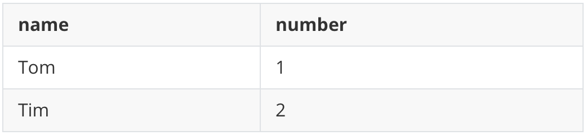
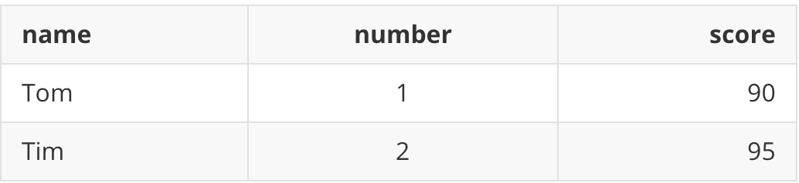

# Markdown的基础语法

本文使用[Typora](https://typora.io/)编写,Typora编辑器让人们能更简单地用Markdown语言书写文字，并且界面简洁优美，实现了实时预览等功能。

## 文本

### 标题

```
语法：'#'+标题名字
```

（一级标题加#，二级加##，最多支持六级标题，Typora严格模式下#后要加空格，非严格模式下不用加空格）

```
# 一级标题用一个#

## 二级标题用两个#

### 三级标题用三个#

#### 四级标题用四个#

##### 五级标题用五个#

###### 六级标题用六个#
```


### 删除线

```
语法：~~文字~~(英文下的波浪号)
```

这是 ~~删除线~~


### 斜体

```
语法：*斜体*（文字前后1个星号*）
```

斜体    *斜体*


### 加粗

```
语法：**加粗**（文字前后2个星号*）
```

加粗   **加粗**


### 斜体+加粗

```
语法：***斜体+加粗***（文字前后3个星号*）
```

斜体+加粗   ***斜体+加粗***


### 下划线

```
语法：下划线是HTML语法 <u>下划线</u>（快捷键command+u，直接生成下划线）
```

下划线    <u>下划线</u>


### 高亮

（默认代码高亮是只支持CSS、JavaScript 和 HTML语言，所以需勾选Typora的Markdown扩展语法）

```
语法：==高亮==（若不支持==高亮==，可以使用HTML语言<mark>高亮</mark>）
```

高亮  <mark>高亮</mark>


### 下标

(需勾选Typora的Markdown扩展语法)

```
语法：~2~（若不支持~2~，可以使用HTML语言<sub>2</sub>）
```

H2O  H<sub>2</sub>O


### 上标

(需勾选Typora的Markdown扩展语法)

```
语法：^2^（若不支持^2^，可以使用HTML语言<sup>2</sup>）
```

面积   m<sup>2</sup>


### 表情符号

Emoji支持表情符号，可使用系统默认的Emoji符号（无法支持Windows用户），也可使用图片表情。

```
语法：:smile:(英文格式下的:，输入:会智能提示）
```

:smile: :laughing: :dizzy_face: :sob: :cold_sweat: :sweat_smile:  :cry: :triumph: :heart_eyes: :relaxed: :sunglasses: :weary:

:+1: :-1: :100: :clap: :bell: :gift: :question: :bomb: :heart: :coffee: :cyclone: :bow: :kiss: :pray: :sweat_drops: :hankey: :exclamation: :anger:

( Mac: `control`+`command`+`space`点选)


### 引用

```
语法：> 文字（在被引用的文本前加上>符号，以及一个空格就可以了，如果只输入了一个>符号会产生一个空白的引用）
```

> 引用

> 

在引用中嵌套引用 

> 引用
>
> 
>
> > 嵌套引用


### 表格

语法：使用`|` 来分隔不同单元格，使用`-`来分隔表头和其他行：

```
| name    | number |
| ------- | ------ |
| Tom     | 1      |
| Tim     | 2      |
```
```
|name|number|
|-|-|
|Tom|1|
|Tim|2|
```
两种写法效果一样



**对齐方式**：在表头下方的分隔线标记中加入 `:`，即可标记该列单元格内容的对齐方式，默认为左对齐( `:-` 左对齐，`:-:` 居中 ，`-:` 右对齐)：

```
|name|number|score|
|:---|:----:|----:|
|Tom | 1    |90   |
|Tim | 2    |95   |
```


**使用快捷键command+opt+T（ctrl+T），更快创建表格,并可以在表格左上角调整表格和对齐方式**


## 列表

### 无序列表

```
语法：
* 星号+空格
+ 加号+空格
- 减号+空格
之后再按回车会自动生成下一行
```

* 星号+空格
+ 加号+空格

- 减号+空格


### 有序列表

```
语法：
1. 数字+‘.’+空格
3. 数字序列不会影响生成的列表序列,最好按自然序列（1.2.3.）
4. 写好一行按下回车自动生成下一个编号
```

1. 数字+‘.’+空格
3. 数字序列不会影响生成的列表序列,最好按自然序列（1.2.3.）
4. 写好一行按下回车自动生成下一个编号


## 代码

### 代码块

> 语法：```语言名称
>
> `在Tab键上（代码块内的文本会以原始内容显示，适合写源码代码）


```java
public static void main(String[] args){
  
}
```

### 行内代码

> 语法：用引号``引起来

`Markdown`、`Java`、`C`


### 分隔线

可以在一行中使用三个或多个`*`、`-`、`_`来添加分隔线

```
***
--------
___

```

***


## 跳转

### 外部跳转---超链接

```
语法：
[link text(提示文字)](link)
[帮助文档](https://support.typora.io/Links/#faq)
```

[参考文档](https://support.typora.io/Links/#faq)

### 内部跳转---本文档内跳转（Typora支持）

```
语法：[link text](#要跳转的标题)
[跳转](#高亮)
```

（内部跳转仅限于跳转到标题）

[跳转](#高亮)

在Typora打开超链接，`commond+click`(Macos)，`ctrl+click`(Linux/Windows)

### 自动链接

```
语法：<URL或邮箱地址>
<>会自动转换为超链接
<https://support.typora.io/>
<123456@email.com>
```

<https://support.typora.io/>

<123456@email.com>


## 图片

```
语法：！[图片名字](图片地址或本地存储路径)
```
### 网上图片

```

```


### 本地图片

```
法一： 语法：
      与文档在同一文件夹内，路径直接写文件名（图片描述可以不写）
      
法二： 直接拷贝(复制粘贴)
```


相对路径插入图片


截图复制粘贴（可在Typora偏好设置-图像-插入图片时，选择复制图片的路径）


