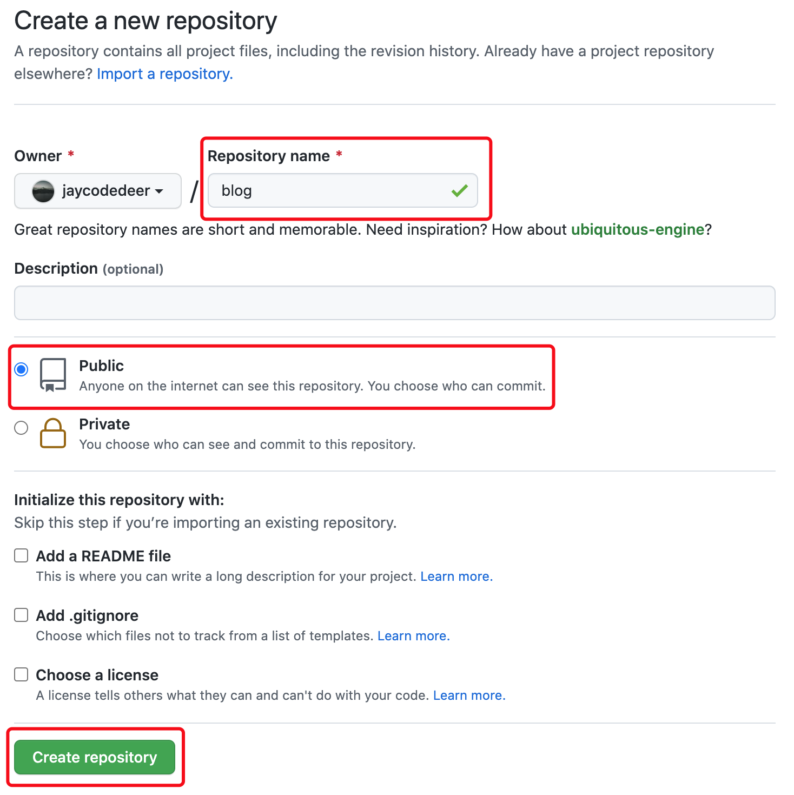
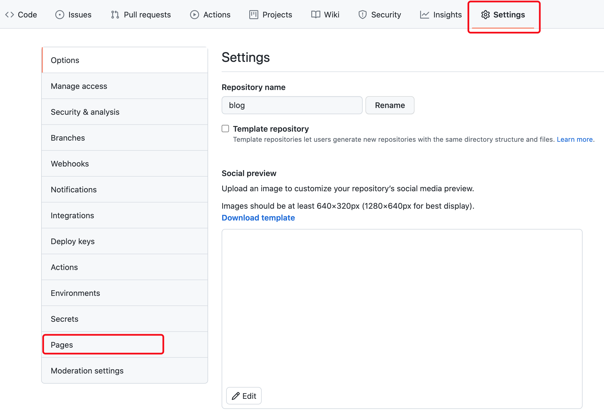

# 博客的搭建

本文是基于docsify和github搭建博客

### docsify

​		[docsify](https://docsify.js.org/)可以帮你快速生成文档网站。不同于 GitBook，它不会生成静态的 `.html` 文件，它会巧妙地加载和解析您的 Markdown 文件并将它们显示为网站。如果你想要开始使用它，只需要创建一个 `index.html` 并将其部署在Github上即可。docsify拥有不同主题和丰富的插件，可以用来写文章、记笔记。

​		docsify可以我参考的是B站的教学视频，过程相对简单且友好。[参考视频](https://www.bilibili.com/video/BV1AQ4y1q7eB)

​		同时也要多参考官网，上面的教程很详细，并且有很多自定义的设置和插件，可用来丰富博客的页面和功能。     


### 部署到GitHub

若想让他人和自己自由访问，需要域名和服务器，这里我们可以借助GitHub，直接托管到Github上。

#### 1.创建仓库并上传文件

仓库名可自行填写，如：blog



将本地博客文件上传到远端仓库中

```
cd 要提交的文件

git init 

git add .

git commit -m  "第一次提交（可随意填写）"

git remote add origin https://github.com/jaycodedeer/blog.git(要提交的仓库地址)

git push -u origin master
```


#### GitHub Pages创建站点

在该仓库下，选中 `Settings` 选项


