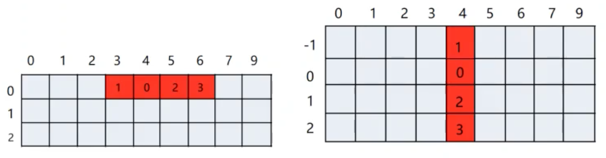
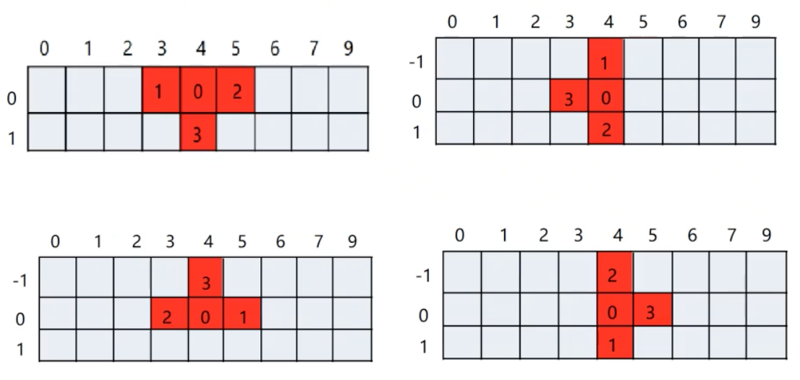
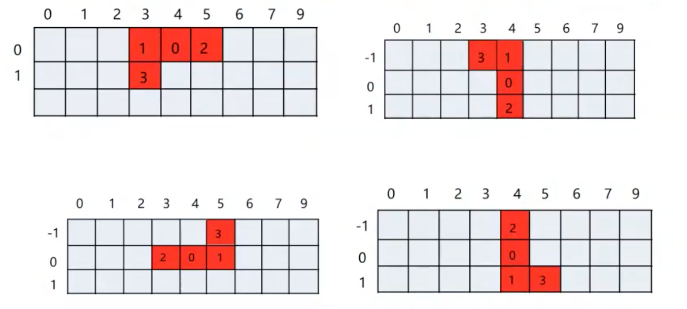
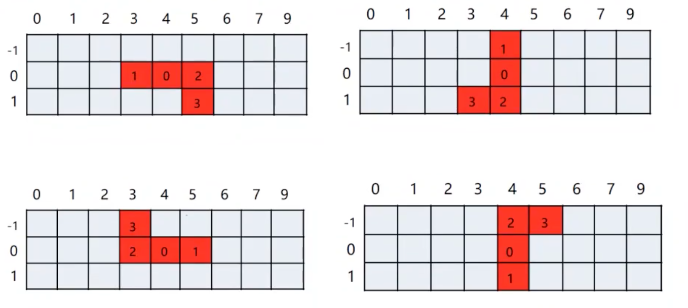
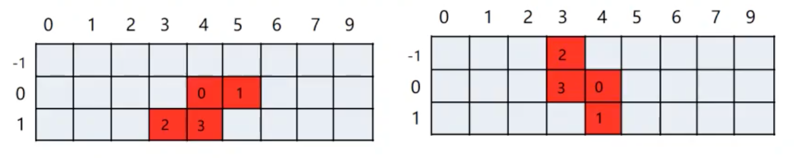
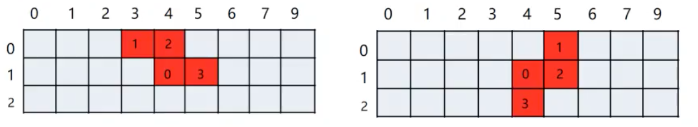
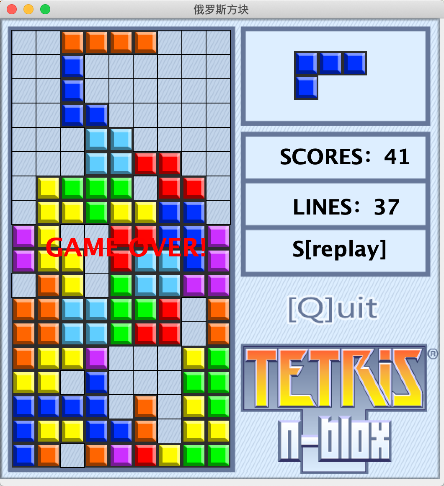

### 7.随机生成四方格

在四方格父类中，编写一个随机生成四方格的静态方法，(int)(Math.random()*7)来表示7个不同形状。

```java
//编写随机生成四方格的方法
    public static Tetromino randomOne(){
        int num = (int)(Math.random()*7);
        Tetromino tetromino = null;
        switch (num){
            case 0:
                tetromino = new I();
                break;
            case 1:
                tetromino = new J();
                break;
            case 2:
                tetromino = new L();
                break;
            case 3:
                tetromino = new O();
                break;
            case 4:
                tetromino = new S();
                break;
            case 5:
                tetromino = new T();
                break;
            case 6:
                tetromino = new Z();
                break;
        }
        return tetromino;
    }
```

在俄罗斯方块主类Tetris中，抽象相应成员：

currentOne表示正在下落的方块

nextOne表示下一个方块

wall表示游戏主区域

```java
//声明正在下落的方块
private Tetromino currentOne = Tetromino.randomOne();
//声明下一个方块
private Tetromino nextOne = Tetromino.randomOne();
//声明游戏主区域(18行9列的二维数组)
private Cell[][] wall = new Cell[18][9];
```


### 8.创建游戏场景

在主类Tetris中创建一个main方法，在main方法中创建游戏场景，窗口尺寸525*550像素。

```java
public static void main(String[] args) {
    //创建一个窗口对象
    JFrame frame = new JFrame("俄罗斯方块");
    //创建游戏界面
    Tetris panel = new Tetris();
    //将面板嵌入到窗口中
    frame.add(panel);
    //设置可见
    frame.setVisible(true);
    //设置窗口尺寸
    frame.setSize(525,550);
    //设置窗口居中
    frame.setLocationRelativeTo(null);
    //窗口关闭的时候程序终止
    frame.setDefaultCloseOperation(JFrame.EXIT_ON_CLOSE);
}
```


### 9. 绘制游戏背景、主区域

在主类Tetris中重写JPanel中的paint方法，绘制游戏背景

绘制游戏主区域paintWall，是一个18行9列的二维数组，每个单元格的宽度和高度为29像素（即每个方块的边长，背景图片为525*550像素），在绘制时需要判断小方格`wall[i][j]`是否有小方格，如果没有则绘制矩形，否则将方块嵌入墙中。

```java
@Override
public void paint(Graphics g) {
		//绘制游戏背景图片
    g.drawImage(backImage,0,0,null);
    //平移坐标轴,使绘制的矩形和游戏主区域重合
    g.translate(14,14);
    //绘制游戏主区域
    paintWall(g);
}

private void paintWall(Graphics g) {
		for(int i=0;i<wall.length;i++){
      	for(int j=0;j<wall[i].length;j++){
          	int x = j*CELL_SIZE;
            int y = i*CELL_SIZE;
            Cell cell = wall[i][j];
            //当前单元格是否有小方块，如果没有则绘制矩形，否则将小方块嵌入墙中
            if(cell==null){
              	g.drawRect(x,y,CELL_SIZE,CELL_SIZE);
            }
            else{
            		g.drawImage(cell.getImage(),x,y,null);
            }
        }
    }
}
```


### 10. 绘制正在下落和下一个的四方块

获取随机生成四方格赋给Cell数组，遍历Cell数组，取得每个小方格的行号和列号乘以宽度值，将每个小方格作为图片画到游戏主区域中，然后在paint方法中调用。（下一个四方格和正在下落的四方格一样，但是要设置位置偏移）

**drawImage方法有下面的参数：**

1. Image img ：需要绘制的图像。
2. int x, int y ：图像左上角坐标。
3. int width, int height ：图像的宽度和高度（单位为象素）。
4. Color bgcolor ：图像下面的颜色。如果图像包含透明象素时这会有用，图像将在指定颜色背景下显示。
5. ImageObserver observer ：一个实现ImageObserver接口的对象。它将该对象登记为一个图像观察者，因此当图像的任何新信息可见时它被通知。大多组件可以简单的指定this。组件可以指定this作为图像观察者的原因是Component类实现了ImageObserver 接口。当图像数据被加载时它的实现调用repaint方法，这通常是你所期望的。

drawImage方法只要要显示的图像数据已经加载完就返回。如果你要确保drawImage只绘制完整的图像，那么你需要跟踪图像的加载。


### 11. 绘制游戏得分和游戏状态

#### 11.1  绘制游戏得分

用scores pool数组存储不同的分数，消除一行得1分，消除两行得3分，消除三行得6分，消除四行得10分；totalScore表示当前获得的游戏分数；totalLine表示当前已消除的行数。


编写paintScore方法绘制游戏得分：

1. g.setFont设置字符串的格式，比如：字体、大小
2. g.drawString用于绘制字符串

**（所有绘制游戏主区域的方法paintWall()，绘制方块的方法paintCurrentOne()、paintNextOne()，绘制得分的方法paintScore()都是通过重写paint()函数调用的）**


#### 11.2  绘制游戏状态

1. 游戏分为三个状态：游戏中、暂停、游戏结束，需要声明常量表示游戏状态，定义一个变量存放当前游戏状态值；

2. 编写绘制游戏当前状态的方法paintState(g)，先声明一个字符串数组show_state用于显示游戏状态。（游戏运行时，按P键暂停；游戏暂停时，按C键继续；游戏结束时，按S键重新开始）

```java
//声明游戏的三种状态：游戏中、暂停、游戏结束
public static final int PLAYING = 0;
public static final int PAUSE = 1;
public static final int END = 2;
//声明一个变量存放当前游戏状态值
private int game_state;

//声明一个数组，用来显示游戏状态
String[] show_state = {"P[pause]","C[continue]","S[replay]"};


//编写绘制游戏当前状态的方法,由paint(Graphics g)调用
private void paintState(Graphics g) {
		if(game_state==PLAYING){
				g.drawString("P[pause]",335,270);
    }else if(game_state==PAUSE){
        g.drawString("C[continue]",335,270);
    }else{
        g.drawString("S[replay]",335,270);
        g.setColor(Color.red);
        g.setFont(new Font(Font.SANS_SERIF,Font.BOLD,30));
        g.drawString("GAME OVER!",40,270);
    }
}
```


### 12. 编写游戏的主要逻辑

#### 12.1  判断方块是否出界

判断方块的行列值即可，行在0-17范围内，列在0-8范围内。

```java
    //判断方块是否出界
    public boolean outOfBounds(){
        Cell[] cells = currentOne.cells;
        for(Cell cell:cells){
            int col = cell.getCol();
            int row = cell.getRow();
            if(row<0 || row>wall.length-1 || col<0 || col>wall[0].length-1 ){
                return  true;
            }
        }
        return false;
    }
```

#### 12.2  判断方块是否重合

判断二维数组的值是否为null，为null则没有重合，不为则重合。

```java
		//判断方块是否重合
    public boolean coincide(){
        Cell[] cells = currentOne.cells;
        for(Cell cell:cells){
            int col = cell.getCol();
            int row = cell.getRow();
            if(wall[row][col] != null){//判断游戏主区域是否为空
                return  true;//不为空，说明有内容，返回true
            }
        }
        return false;
    }
```

#### 12.3  按键一次四方格左移一次或右移一次

```java
		//按键一次四方格左移一次
    public void moveLeftAction(){
        currentOne.moveLeft();
        //判断是否越界或四方格是否重合
        if(outOfBounds() || coincide()){
            currentOne.moveRight();
        }
    }
		//按键一次四方格右移一次
    public void moveRightAction(){
        currentOne.moveRight();
        //判断是否越界或四方格是否重合
        if(outOfBounds() || coincide()){
            currentOne.moveLeft();
        }
    }
```

#### 12.4  四方格变形（旋转）

四方格变形需要记录每个小方块在不同形状时，相对于第一个小方块（序号为0的方块）的位置。(以序号0的方块为基准，以它为旋转中心)

##### 12.4.1  添加旋转状态类（内部类）和计数器

1. 在四方格父类Tetromino中添加旋转状态类（内部类）和计数器。
2. 计数器对当前状态取余，不同四方格旋转次数不同（0次、2次、4次），所以计数器的取值最好是4的整数倍。
3. 旋转状态类，属性：存储四方格各元素的相对位置，编写实体类。

```java
		//编写旋转状态
    protected State[] states;
    //声明旋转次数
    private int count = 100;

    //编写四方格旋转状态的内部类
    class State{
        //编写属性：存储四方格各元素的相对位置（共四个小方格）
        int row0,col0 ,row1,col1 ,row2,col2 ,row3,col3;

        public State() {
        }

        public State(int row0, int col0, int row1, int col1, int row2, int col2, int row3, int col3) {
            this.row0 = row0;
            this.col0 = col0;
            this.row1 = row1;
            this.col1 = col1;
            this.row2 = row2;
            this.col2 = col2;
            this.row3 = row3;
            this.col3 = col3;
        }

        public int getRow0() {
            return row0;
        }

        public int getCol0() {
            return col0;
        }

        public int getRow1() {
            return row1;
        }

        public int getCol1() {
            return col1;
        }

        public int getRow2() {
            return row2;
        }

        public int getCol2() {
            return col2;
        }

        public int getRow3() {
            return row3;
        }

        public int getCol3() {
            return col3;
        }

        public void setRow0(int row0) {
            this.row0 = row0;
        }

        public void setCol0(int col0) {
            this.col0 = col0;
        }

        public void setRow1(int row1) {
            this.row1 = row1;
        }

        public void setCol1(int col1) {
            this.col1 = col1;
        }

        public void setRow2(int row2) {
            this.row2 = row2;
        }

        public void setCol2(int col2) {
            this.col2 = col2;
        }

        public void setRow3(int row3) {
            this.row3 = row3;
        }

        public void setCol3(int col3) {
            this.col3 = col3;
        }

        @Override
        public String toString() {
            return "State{" +
                    "row0=" + row0 +
                    ", col0=" + col0 +
                    ", row1=" + row1 +
                    ", col1=" + col1 +
                    ", row2=" + row2 +
                    ", col2=" + col2 +
                    ", row3=" + row3 +
                    ", col3=" + col3 +
                    '}';
        }
    }
```

##### 12.4.2  初始化7个四方格的相对坐标

I型四方格有两种旋转状态，在I无参构造方法中初始化两种状态的相对坐标。



```java
        //共计两种旋转状态
        states = new State[2];
        //初始化两种状态的相对坐标
        states[0] = new State(0,0,0,-1,0,1,0,2);
        states[1] = new State(0,0,-1,0,1,0,2,0);
```

T型四方格有四种旋转状态



```java
        //共计4种旋转状态
        states = new State[4];
        //初始化4种状态的相对坐标
        states[0] = new State(0,0,0,-1,0,1,1,0);
        states[1] = new State(0,0,-1,0,1,0,0,-1);
        states[2] = new State(0,0,0,1,0,-1,-1,0);
        states[3] = new State(0,0,1,0,-1,0,0,1);
```

L型四方格有四种旋转状态



```java
        //共计4种旋转状态
        states = new State[4];
        //初始化4种状态的相对坐标
        states[0] = new State(0,0,0,-1,0,1,1,-1);
        states[1] = new State(0,0,-1,0,1,0,-1,-1);
        states[2] = new State(0,0,0,1,0,-1,-1,1);
        states[3] = new State(0,0,1,0,-1,0,1,1);
```

J型四方格有两种旋转状态



```java
        //共计4种旋转状态
        states = new State[4];
        //初始化4种状态的相对坐标
        states[0] = new State(0,0,0,-1,0,1,1,1);
        states[1] = new State(0,0,-1,0,1,0,1,-1);
        states[2] = new State(0,0,0,1,0,-1,-1,-1);
        states[3] = new State(0,0,1,0,-1,0,-1,1);
```

S型四方格有两种旋转状态



```java
        //共计两种旋转状态
        states = new State[2];
        //初始化两种状态的相对坐标
        states[0] = new State(0,0,0,1,1,-1,1,0);
        states[1] = new State(0,0,1,0,-1,-1,0,-1);
```

Z型四方格有两种旋转状态



```java
        //共计两种旋转状态
        states = new State[2];
        //初始化两种状态的相对坐标
        states[0] = new State(0,0,-1,-1,-1,0,0,1);
        states[1] = new State(0,0,-1,1,0,1,1,0);
```

O型四方格有零种旋转状态，在I无参构造方法中初始化两种状态的相对坐标。

```java
        //共计0种旋转状态
        states = new State[0];
```


##### 12.4.3  编写顺时针、逆时针旋转四方格方法

在四方格父类Tetromino中创建顺时针、逆时针旋转四方格方法rotateRight( )和rotateLeft( )。

```java
    //编写旋转状态
    protected State[] states;
    //声明旋转次数
    private int count = 100;


    //编写顺时针旋转四方格方法
    public void rotateRight(){
        //要判断四方格有几种旋转状态（O型方格零种旋转状态则不需要旋转）
        if (states.length==0){
            return;
        }
        //旋转次数加一
        count++;
        State s = states[count % states.length];
        Cell cell = cells[0];
        int row = cell.getRow();
        int col = cell.getCol();
        //以0序号方块为基准，利用相对位置，得出其他3个方格的坐标
        cells[1].setRow(row + s.row1);
        cells[1].setCol(col + s.col1);
        cells[2].setRow(row + s.row2);
        cells[2].setCol(col + s.col2);
        cells[3].setRow(row + s.row3);
        cells[3].setCol(col + s.col3);
    }


    //编写逆时针旋转四方格方法
    public void rotateLeft(){
        //要判断四方格有几种旋转状态（O型方格零种旋转状态则不需要旋转）
        if (states.length==0){
            return;
        }
        //旋转次数减一
        count--;
        State s = states[count % states.length];
        Cell cell = cells[0];
        int row = cell.getRow();
        int col = cell.getCol();
        //以0序号方块为基准，利用相对位置，得出其他3个方格的坐标
        cells[1].setRow(row + s.row1);
        cells[1].setCol(col + s.col1);
        cells[2].setRow(row + s.row2);
        cells[2].setCol(col + s.col2);
        cells[3].setRow(row + s.row3);
        cells[3].setCol(col + s.col3);
    }
```

##### 12.4.4  创建顺时针、逆时针旋转旋转

判断四方格是否越界或重合时，则不需要旋转（在主类中创建）

```java
    //创建顺时针旋转
    public void rotateRightAction(){
        currentOne.rotateRight();
        //判断四方格是否越界或重合
        if(outOfBounds() || coincide()){
            //如果越界或重合，四方格再逆时针旋转回来
            currentOne.rotateLeft();
        }
    }

    //创建逆时针旋转
    public void rotateLeftAction(){
        currentOne.rotateLeft();
        //判断四方格是否越界或重合
        if(outOfBounds() || coincide()){
            //如果越界或重合，四方格再逆时针旋转回来
            currentOne.rotateRight();
        }
    }
```


#### 12.5  判断游戏是否结束

在俄罗斯方块主类Tetris中编写，判断下一个将要出现方块的位置是否有方块

```java
    //判断游戏是否结束
    public boolean isGameOver(){
        Cell[] cells = nextOne.cells;
        for (Cell cell:cells){
            int row = cell.getRow();
            int col = cell.getCol();
            if(wall[row][col] != null){
                return true;//主区域已有方块，返回true
            }
        }
        return false;
    }
```


#### 12.6  消行并计分

行满时消除满行并将消除行以上的方块下落到对应行数同时计分

1. 创建判断当前行是否已满的方法isFullLine

```java
    //判断当前行是否已满
    public boolean isFullLine(int row){
        Cell[] cells = wall[row];
        for(Cell cell:cells){
            if(cell == null){
                return false;
            }
        }
        return true;
    }
```

2. 创建消行方法destroyLine并计分

```java
    //创建消行方法
    public void destroyLine(){
        //声明变量，统计当前消除的行数
        int line = 0;
        //正在下落的四方格
        Cell[] cells = currentOne.cells;
        for(Cell cell:cells){
            int row = cell.getRow();
            //判断遍历方块所在行是否满行
            if(isFullLine(row)){
                line++;
                for(int i=row;i>0;i--){
                    System.arraycopy(wall[i-1],0,wall[i],0,wall[0].length);
                }
                //将第0行重置，重新创建
                wall[0] = new Cell[9];
            }
        }
        //在分数池中获取分数，累加到总分数上
        totalScore += scores_pool[line];//消除了几行，获取对应分数
        //统计消除总行数
        totalLine += line;
    }
```


#### 12.7  判断四方格能否下落、按键一次四方格下落一行操作、瞬间下落操作、自动下落

1. 判断是否到底部以及每个小方块下一行是否已有方块

```java
    //判断四方格能否下落
    public boolean canDrop(){
        Cell[] cells = currentOne.cells;
        for(Cell cell:cells){
            int row = cell.getRow();
            int col = cell.getCol();
            //判断是否到达底部
            if(row==wall.length-1){
                return false;
            }else if(wall[row+1][col]!=null){//判断下一行对应元素是否有方块
                return false;
            }
        }
        return true;
    }
```

2. 实现按键一次四方格下落一行操作

首先判断能否下落，能下落就下移，否则将四方格嵌入墙中，同时判断能否消行，还要判断游戏是否结束，如果没有结束，继续生成四方格

```java
    //按键一次四方格下落一行
    public void sortDropAction(){
        //判断能否下落
        if(canDrop()){
            //当前四方格下落一格
            currentOne.softDrop();
        }else {
            //将四方格嵌入墙中
            landToWall();
            //判断能否消行
            destroyLine();
            //判断游戏是否结束
            if(isGameOver()){
                game_state = END;
            }else {
                //游戏没有结束，继续生成新的四方格
                currentOne = nextOne;
                nextOne = Tetromino.randomOne();
            }
        }
    }

    //实现嵌入方块方法
    private void landToWall() {
        Cell[] cells = currentOne.cells;
        for(Cell cell:cells){
            int row = cell.getRow();
            int col = cell.getCol();
            wall[row][col] = cell;
        }
    }
```

3. 瞬间下落操作

按一个键四方格瞬间到底,原理和下落一格略有不同（循环判断能否下落一格）

```java
    //瞬间下落
    public void fastDropAction(){
        //判断四方格能否下落到底部
        while(true){
            //判断四方格能否下落一格
            if(canDrop()){
                currentOne.softDrop();
            }else {
                break;
            }
        }
        //不能下落后，将四方格嵌入墙中
        landToWall();
        //判断能否消行
        destroyLine();
        //判断游戏是否结束
        if(isGameOver()){
            game_state = END;
        }else {
            //游戏没有结束，继续生成新的四方格
            currentOne = nextOne;
            nextOne = Tetromino.randomOne();
        }
    }
```


#### 12.8  编写start方法：键盘监听事件、将窗口设置成焦点、设置自动下落

在主类中编写start方法，存放一些主要逻辑

1. 通过调用匿名内部类重写keyPressed方法实现按键的响应，并根据得到的相应按键做出对应操作

2. 必须要把俄罗斯方块这个窗口设为焦点，否则监听无效

```java
//俄罗斯方块窗口设置成焦点
this.addKeyListener(l);
this.requestFocus();
```

3. 自动下落：每格0.5下落一次，直到不能下落，则将四方格嵌入墙中，并判断消行和游戏是否结束，每次下落都需要重绘一次游戏界面

   分析：只有游戏状态是游戏中的情况下，才会需要自动下落，所以先判断游戏状态；每隔0.5秒，所以要用循环while(true)

4. 最后把start方法添加到main方法中（使用main创建的实体对象panel调用）

```java
    //编写start方法，存放一些主要逻辑：键盘监听事件、将窗口设置成焦点、设置自动下落
    public void start(){
        //调用start，肯定是要开始游戏，先设置游戏状态
        game_state = PLAYING;
        //创建匿名内部对象，存储监听内容
        KeyListener l = new KeyAdapter(){
            @Override
            public void keyPressed(KeyEvent e) {
                //获取当前的按键
                int code = e.getKeyCode();
                switch (code){
                    case KeyEvent.VK_DOWN:
                        sortDropAction();//下落一格
                        break;
                    case KeyEvent.VK_Z:
                        rotateRightAction();//顺时针旋转
                        break;
                    case KeyEvent.VK_X:
                        rotateLeftAction();//逆时针旋转
                        break;
                    case KeyEvent.VK_LEFT:
                        moveLeftAction();//左移
                        break;
                    case KeyEvent.VK_RIGHT:
                        moveRightAction();//右移
                        break;
                    case KeyEvent.VK_SPACE:
                        fastDropAction();//瞬间下落
                        break;
                    case KeyEvent.VK_P://按P暂停
                        //先判断游戏状态
                        if(game_state==PLAYING){
                            game_state=PAUSE;
                        }
                        break;
                    case KeyEvent.VK_C://按C继续
                        if(game_state==PAUSE){
                            game_state=PLAYING;
                        }
                        break;
                    case KeyEvent.VK_S:
                        //表示游戏游戏重新开始，所有数据重置
                        game_state = PLAYING;
                        wall = new Cell[18][9];
                        currentOne = Tetromino.randomOne();
                        nextOne = Tetromino.randomOne();
                        totalScore = 0;
                        totalLine = 0;
                        break;
                }
            }
        };

        //俄罗斯方块窗口设置成焦点
        this.addKeyListener(l);
        this.requestFocus();

        while(true){
            //判断游戏状态（当前游戏状态是游戏中时，每隔0.5秒下落一次）
            if(game_state==PLAYING){
                try {
                    Thread.sleep(500);
                } catch (InterruptedException e) {
                    e.printStackTrace();
                }
                //判断能否下落
                if(canDrop()){
                    currentOne.softDrop();
                }else {
                    //不能下落，嵌入墙中
                    landToWall();
                    //判断能否消行
                    destroyLine();
                    //判断游戏是否结束
                    if(isGameOver()){
                        game_state = END;
                    }else {
                        //游戏没有结束，继续生成新的四方格
                        currentOne = nextOne;
                        nextOne = Tetromino.randomOne();
                    }

                }
            }
            repaint();
        }
    }
```


### 运行效果




