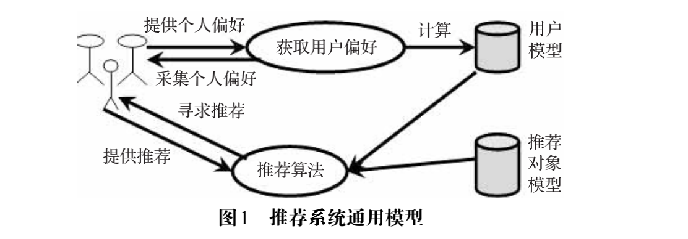

## 推荐系统

### 概念及模块

​        Resnick和Varian在1997年给出的：“它是利用电子商务网站向客户提供商品信息和建议，帮助用户决定应该购买什么产品，模拟销售人员帮助客户完成购买过程”。

​        推荐系统有3个重要的模块：用户建模模块、推荐对象建模模块、推荐算法模块。推荐系统把用户模型中兴趣需求信息和推荐对象模型中的特征信息匹配，同时使用相应的推荐算法进行计算筛选，找到用户可能感兴趣的推荐对象，然后推荐给用户。

​        推荐系统的形式化定义如下：设*C*是所有用户的集合， *S*是所有可以推荐给用户的对象的集合。实际上，*C*和*S*集合的规模通常很大，如上百万的顾客以及上亿种歌曲等。设效用函数*u*( )可以计算对象*s*对用户*c*的推荐度（如提供商的可靠性（vendor reliability）和产品的可得性（product availability） 等），即u:C✖️S->R，R是一定范围内的全序的非负实数，推荐要研究的问题就是找到推荐度*R*最大的那些对象S*

（argmax 就是使后面式子达到最大值时的变量的取值）

### 用户建模模块

​        推荐系统为用户建立一个用户模型，该模型能获取、表示、存储和修改用户兴趣偏好，能进行推理，对用户进行分类和识别，帮助系统更好地理解用户特征和类别，理解用户的需求和任务，从而更好地实现用户所需要的功能。

（1）模型的输入数据有哪些，如何获取模型的输入数据。 

（2）如何考虑用户的兴趣及需求的变化。 

（3）建模的对象是谁。 

（4）清楚了上述内容后，怎么建模呢。 

（5）模型的输出是什么。

